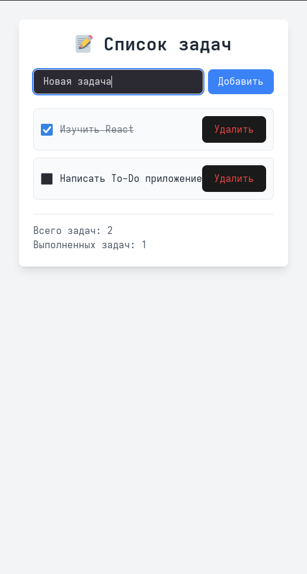
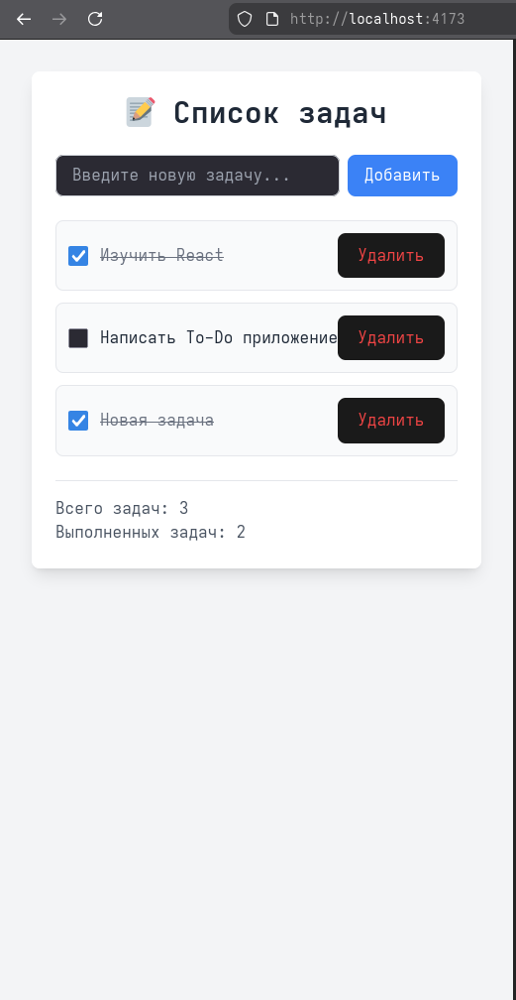
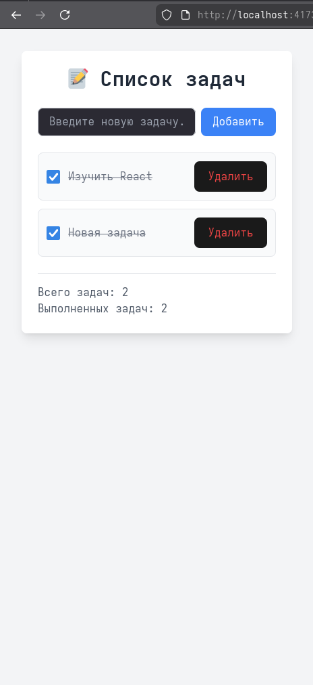
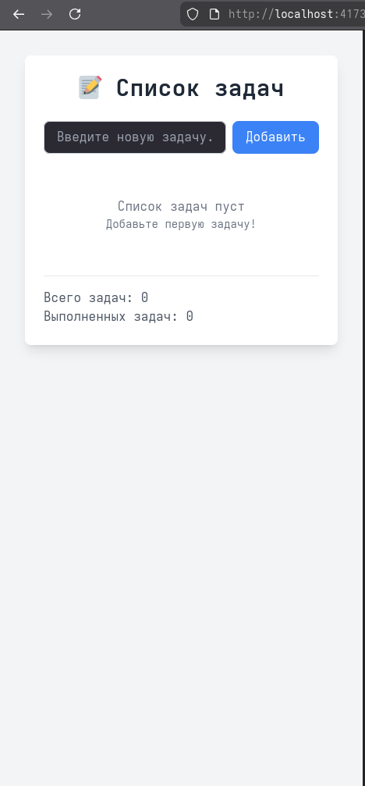

# **Отчет по лабораторной работе №1: React-приложение с Vite и знакомство с Next.js**

## Сведения о студенте  
**Дата:** 2026-02-13  
**Семестр:** 2 курс, 2 семестр  
**Группа:** Пин-б-о-24-1  
**Дисциплина:** Технологии программирования  
**Студент:** Лебский Артём Александрович  

---
### Структура готового проекта
```
lab0101/
├── todo-app/
│ ├── src/
│ │   ├── App.tsx          # Основной компонент приложения
│ │   ├── main.tsx         # Точка входа
│ │   └── index.css        # Глобальные стили с Tailwind
│ ├── public/              # Статические файлы
│ ├── index.html           # HTML шаблон
│ ├── package.json         # Зависимости и скрипты
│ ├── tailwind.config.js   # Конфигурация Tailwind
│ ├── vite.config.ts       # Конфигурация Vite
│ └── tsconfig.json        # Конфигурация TypeScript
├── portfolio-site/
│ ├── app/
│ │   ├── layout.tsx
│ │   ├── page.tsx
│ │   ├── about/
│ │   │   └── page.tsx
│ │   ├── blog/
│ │   │   ├── page.tsx
│ │   │   ├── data.ts
│ │   │   └── [slug]/
│ │   │       ├── page.tsx
│ │   │       └── not-found.tsx
│ │   ├── projects/
│ │   │   └── page.tsx
│ │   └── components/
│ │       └── ProjectCard.tsx
│ ├── public/
│ ├── package.json
│ ├── tailwind.config.js
│ └── tsconfig.json
└── task/
     ├── lab0101-React-приложение с Vite.md
     └── lab0102-Знакомство с Next.js.md

     

```

## Часть 1. React-приложение с Vite

### 1. ЦЕЛЬ РАБОТЫ

Практическое знакомство с созданием React-приложений с использованием TypeScript и Vite. Освоение базовых концепций компонентного подхода и управления состоянием на примере приложения «Список задач» (To-Do List).

### 2. ЗАДАЧИ РАБОТЫ

**Выполнены следующие задачи:**

1. Настройка проекта с Vite + React + TypeScript.
2. Интеграция Tailwind CSS для стилизации интерфейса.
3. Создание компонента `App` с управлением состоянием задач.
4. Реализация функций:
   - добавление новой задачи (`addTask`);
   - удаление задачи по ID (`removeTask`);
   - переключение статуса выполнения (`toggleTask`);
   - отображение статистики (всего задач, количество выполненных);
   - условный рендеринг для пустого списка.
5. Обеспечение неизменяемости состояния (иммутабельность).
6. Соблюдение типизации TypeScript для всех данных и функций.
7. Формирование структуры проекта и подготовка отчёта.

### 3. РАЗРАБОТАННОЕ ПРИЛОЖЕНИЕ

#### 3.1. Общая архитектура

Приложение представляет собой одностраничный интерфейс для управления списком задач. Основной компонент `App` содержит два состояния:

- `tasks` – массив объектов типа `Task`;
- `newTask` – строка для ввода новой задачи.

Все операции с задачами выполняются через функции, которые обновляют состояние, соблюдая принцип неизменяемости.

#### 3.2. Типы данных

```typescript
interface Task {
  id: number;
  text: string;
  completed: boolean;
}
```

#### 3.3. Основные функции

##### **Добавление задачи**
- Проверка на пустую строку.
- Создание объекта задачи с уникальным `id` (`Date.now()`).
- Добавление в конец массива через `setTasks([...tasks, task])`.

##### **Удаление задачи**
- Использование метода `filter` для создания нового массива без задачи с указанным `id`.
- Вызов `setTasks` с отфильтрованным массивом.

##### **Переключение статуса**
- Применение `map` для обхода массива.
- Для задачи с совпадающим `id` создаётся копия объекта с инвертированным полем `completed`.
- Остальные задачи возвращаются без изменений.

##### **Статистика**
- Общее количество задач: `tasks.length`.
- Количество выполненных: `tasks.filter(task => task.completed).length`.

##### **Обработка пустого списка**
- Условный рендеринг: если `tasks.length === 0`, отображается информационное сообщение.

#### 3.4. Интерфейс

- Поле ввода с обработкой клавиши `Enter`.
- Кнопка «Добавить».
- Список задач с чекбоксами и кнопками удаления.
- Стилизация выполнена с помощью Tailwind CSS (адаптивный дизайн, тени, отступы).

### 4. ИСХОДНЫЙ КОД (App.tsx)

```tsx
import React, { useState } from 'react';

// Тип для задачи
interface Task {
  id: number;
  text: string;
  completed: boolean;
}

function App() {
  // Состояние для списка задач
  const [tasks, setTasks] = useState<Task[]>([
    { id: 1, text: 'Изучить React', completed: true },
    { id: 2, text: 'Написать To-Do приложение', completed: false }
  ]);

  // Состояние для новой задачи
  const [newTask, setNewTask] = useState('');

  // Функция добавления задачи
  const addTask = () => {
    if (newTask.trim() === '') return;
    
    const task: Task = {
      id: Date.now(),
      text: newTask,
      completed: false
    };
    
    setTasks([...tasks, task]);
    setNewTask('');
  };

  // Функция удаления задачи
  const removeTask = (id: number) => {
    const updatedTasks = tasks.filter(task => task.id !== id);
    setTasks(updatedTasks);
  };

  // Функция переключения статуса задачи
  const toggleTask = (id: number) => {
    const updatedTasks = tasks.map(task => {
      if (task.id === id) {
        return { ...task, completed: !task.completed };
      }
      return task;
    });
    setTasks(updatedTasks);
  };

  return (
    <div className="min-h-screen bg-gray-100 p-8">
      <div className="max-w-2xl mx-auto bg-white rounded-lg shadow-lg p-6">
        <h1 className="text-3xl font-bold text-center mb-6 text-gray-800">
          📝 Список задач
        </h1>
        
        {/* Форма добавления задачи */}
        <div className="flex gap-2 mb-6">
          <input
            type="text"
            value={newTask}
            onChange={(e) => setNewTask(e.target.value)}
            onKeyDown={(e) => e.key === 'Enter' && addTask()}
            placeholder="Введите новую задачу..."
            className="flex-grow px-4 py-2 border border-gray-300 rounded-lg focus:outline-none focus:ring-2 focus:ring-blue-500"
          />
          <button
            onClick={addTask}
            className="px-4 py-2 bg-blue-500 text-white rounded-lg hover:bg-blue-600 transition"
          >
            Добавить
          </button>
        </div>

        {/* Список задач */}
        <div className="space-y-3">
          {tasks.map(task => (
            <div 
              key={task.id} 
              className="flex items-center justify-between p-3 bg-gray-50 rounded-lg border"
            >
              <div className="flex items-center gap-3">
                <input
                  type="checkbox"
                  checked={task.completed}
                  onChange={() => toggleTask(task.id)}
                  className="h-5 w-5 text-blue-600"
                />
                <span className={`${task.completed ? 'line-through text-gray-500' : 'text-gray-800'}`}>
                  {task.text}
                </span>
              </div>
              
              {/* Кнопка удаления */}
              <button
                onClick={() => removeTask(task.id)}
                className="px-3 py-1 text-red-500 hover:text-red-700 hover:bg-red-50 rounded transition"
              >
                Удалить
              </button>
            </div>
          ))}
          
          {/* Сообщение при пустом списке */}
          {tasks.length === 0 && (
            <div className="text-center py-8 text-gray-500">
              <p>Список задач пуст</p>
              <p className="text-sm">Добавьте первую задачу!</p>
            </div>
          )}
        </div>

        {/* Статистика */}
        <div className="mt-6 pt-4 border-t">
          <p className="text-gray-600">
            Всего задач: {tasks.length}
          </p>
          <p className="text-gray-600">
            Выполнено: {tasks.filter(task => task.completed).length}
          </p>
        </div>
      </div>
    </div>
  );
}

export default App;
```

### 5. СКРИНШОТЫ РАБОТЫ ПРИЛОЖЕНИЯ (Часть 1)


- **Скриншот 1:** Главный экран с двумя задачами (одна выполнена).  
  

- **Скриншот 2:** Добавление новой задачи через поле ввода.  
  

- **Скриншот 3:** Задача отмечена как выполненная (перечёркнутый текст).  
  

- **Скриншот 4:** Удаление задачи, обновлённый список.  
  

- **Скриншот 5:** Пустой список с информационным сообщением.  
  

### 6. ОТВЕТЫ НА КОНТРОЛЬНЫЕ ВОПРОСЫ (Часть 1)

#### **1. Объясните принцип работы хука `useState`**

`useState` — это встроенный хук React, который позволяет функциональному компоненту иметь внутреннее состояние. Он возвращает массив из двух элементов: текущее значение состояния и функцию для его обновления. При вызове функции обновления React перерисовывает компонент с новым значением. В данном приложении `useState` используется для хранения массива задач и значения поля ввода.

#### **2. Почему в React важно использовать неизменяемое состояние?**

Неизменяемость (иммутабельность) состояния гарантирует, что React может эффективно определять изменения и перерисовывать только те компоненты, которые действительно изменились. При прямом мутировании объекта (например, `tasks.push(newTask)`) ссылка на объект остаётся прежней, и React может не заметить изменения. Создание нового массива или объекта через spread-оператор или методы `map`/`filter` гарантирует обнаружение изменений и корректную работу механизма сравнения (shallow comparison).

#### **3. Какой метод массива вы использовали для удаления задачи и почему?**

Для удаления задачи использован метод `filter`. Он создаёт новый массив, содержащий все элементы, для которых переданная функция возвращает `true`. В нашем случае условие `task.id !== id` отсеивает задачу с указанным идентификатором. `filter` идеально подходит для этой задачи, так как он не изменяет исходный массив и возвращает новый, что соответствует принципу неизменяемости.

#### **4. В чём преимущества TypeScript при разработке React-приложений?**

TypeScript добавляет статическую типизацию, что позволяет:
- Обнаруживать ошибки на этапе компиляции (например, передача неверного пропса);
- Улучшить автодополнение и документацию кода в IDE;
- Чётко определить структуру данных (интерфейсы для пропсов, состояния, событий);
- Облегчить рефакторинг и поддержку кода в больших проектах;
- Сделать код более самодокументированным.

В данной работе TypeScript гарантирует, что объекты задач всегда содержат поля `id`, `text`, `completed` правильных типов, а функции получают аргументы ожидаемого типа.

### 7. ВЫВОДЫ (Часть 1)

В ходе выполнения лабораторной работы было создано полнофункциональное React-приложение для управления списком задач. Все обязательные и дополнительные требования реализованы:

- Корректно работают функции добавления, удаления и переключения статуса задач.
- Состояние обновляется иммутабельно с использованием `filter` и `map`.
- Добавлена статистика и обработка пустого списка.
- Применён TypeScript для типизации всех данных и функций.
- Интерфейс стилизован с помощью Tailwind CSS.

Полученные навыки являются основой для дальнейшего изучения современных фронтенд-технологий и разработки более сложных приложений на React.

---

## Часть 2. Знакомство с Next.js

### Цель работы

Практическое знакомство с Next.js — мета-фреймворком для React. Освоение концепций серверного рендеринга (SSG), файловой маршрутизации и деплоя.

### 1. Исходный код (файлы с дополнениями)

Ниже представлены все созданные и модифицированные файлы проекта. В шаблонные файлы (layout.tsx, page.tsx, globals.css) изменения не вносились, поэтому они не дублируются. Дополнения, заменяющие комментарии `TODO`, выделены **жирным** в тексте кода.

#### Файл: `app/about/page.tsx`

**Изменения:** заполнен список навыков (5 пунктов) и опыт работы (3 пункта).

```tsx
export default function AboutPage() {
  return (
    <div className="max-w-3xl mx-auto">
      <h1 className="text-3xl font-bold mb-6">Обо мне</h1>
      
      <div className="bg-white p-6 rounded-lg shadow-lg mb-6">
        <h2 className="text-xl font-semibold mb-3 text-gray-600">Навыки</h2>
        <ul className="list-disc pl-5 space-y-1">
          <li className="text-base font-semibold mb-3 text-gray-500">HTML/CSS</li>
          <li className="text-base font-semibold mb-3 text-gray-500">JavaScript</li>
          <li className="text-base font-semibold mb-3 text-gray-500">Git</li>
          <li className="text-base font-semibold mb-3 text-gray-500">React</li>
          <li className="text-base font-semibold mb-3 text-gray-500">Next.js</li>
        </ul>
      </div>
      
      <div className="bg-white p-6 rounded-lg shadow-lg">
        <h2 className="text-xl font-semibold mb-3 text-gray-600">Опыт работы</h2>
        <div className="space-y-4">
          <p className="text-base font-semibold mb-3 text-gray-500">Microsoft</p>
          <p className="text-base font-semibold mb-3 text-gray-500">Apple</p>
          <p className="text-base font-semibold mb-3 text-gray-500">Android</p>
        </div>
      </div>
    </div>
  )
}
```

#### Файл: `app/blog/data.ts`

**Изменения:** добавлены две новые статьи (Django и Flask).

```typescript
export interface BlogPost {
  id: number
  title: string
  slug: string
  excerpt: string
  content: string
  date: string
  author: string
}

export const blogPosts: BlogPost[] = [
  {
    id: 1,
    title: 'Введение в Next.js',
    slug: 'introduction-to-nextjs',
    excerpt: 'Основы Next.js и преимущества серверного рендеринга',
    content: 'Полный текст статьи о Next.js...',
    date: '2026-01-15',
    author: 'Иван Иванов'
  },
  {
    id: 2,
    title: 'Введение в Django',
    slug: 'introduction-to-django',
    excerpt: 'Основы Python и преимущества Django',
    content: 'Полный текст статьи о Django...',
    date: '2026-02-13',
    author: 'Вася Пупкин'
  },
  {
    id: 3,
    title: 'Введение в Flask',
    slug: 'introduction-to-flask',
    excerpt: 'Основы Python и преимущества Flask',
    content: 'Полный текст статьи о Flask...',
    date: '2026-02-13',
    author: 'Вася Пупкин'
  }
]
```

#### Файл: `app/blog/[slug]/page.tsx`

**Изменения:**
- Исправлена типизация `params` как `Promise<{ slug: string }>` и добавлено `await params` (соответствует Next.js 15).
- Добавлено отображение полного содержания статьи (`post.content`).

```tsx
import Link from 'next/link'
import { notFound } from 'next/navigation'
import { blogPosts } from '../data'

// Функция для генерации статических путей
export async function generateStaticParams() {
  return blogPosts.map((post) => ({
    slug: post.slug,
  }))
}

export default async function BlogPostPage({
  params,
}: {
  params: Promise<{ slug: string }>
}) {
  const { slug } = await params
  
  const post = blogPosts.find(p => p.slug === slug)
  
  if (!post) {
    notFound()
  }

  return (
    <article className="max-w-3xl mx-auto">
      <header className="mb-8">
        <h1 className="text-3xl font-bold mb-2">{post.title}</h1>
        <div className="flex justify-between text-gray-600">
          <span>{post.date}</span>
          <span>Автор: {post.author}</span>
        </div>
      </header>
      
      <div className="prose max-w-none">
        <p className="text-lg mb-4">{post.excerpt}</p>
        <div className="mt-6">
          {post.content}
        </div>
      </div>
      
      <div className="mt-8 pt-4 border-t">
        <Link 
          href="/blog"
          className="text-blue-600 hover:text-blue-800"
        >
          ← Вернуться к списку статей
        </Link>
      </div>
    </article>
  )
}
```

#### Файл: `app/components/ProjectCard.tsx`

**Изменения:** добавлен рендер массива `technologies` в виде простых тегов.

```tsx
interface ProjectCardProps {
  title: string
  description: string
  technologies: string[]
  link?: string
}

export default function ProjectCard({ 
  title, 
  description, 
  technologies,
  link 
}: ProjectCardProps) {
  return (
    <div className="border rounded-lg p-6 shadow-sm hover:shadow-md transition-shadow">
      <h3 className="text-xl font-semibold mb-2">{title}</h3>
      <p className="text-gray-600 mb-4">{description}</p>
      <div className="mb-4">
        <span className="text-sm font-medium">Технологии: </span>
        {technologies.map((tech, index) => (
          <span
            key={index}
            className="p-1 text-gray-100 text-sm rounded-md"
          >
            {tech}
          </span>
        ))}
      </div>
      {link && (
        <a 
          href={link}
          target="_blank"
          rel="noopener noreferrer"
          className="inline-block text-blue-600 hover:text-blue-800"
        >
          Посмотреть проект →
        </a>
      )}
    </div>
  )
}
```

#### Файл: `app/projects/page.tsx`

**Изменения:**
- Создан массив проектов (3 элемента) с типами.
- Использован компонент `ProjectCard` для отображения каждого проекта.

```tsx
import ProjectCard from '../components/ProjectCard'

interface Project {
  title: string;
  description: string;
  technologies: string[];
  link: string;
}

const projects: Project[] = [
  {
    title: 'Интернет-магазин',
    description: 'Полнофункциональный интернет-магазин с корзиной и оплатой',
    technologies: ['Next.js', 'TypeScript', 'Stripe'],
    link: 'https://example.com'
  },
  {
    title: 'Игровой-интернет-магазин',
    description: 'Полнофункциональный игровой-интернет-магазин с корзиной и оплатой',
    technologies: ['Next.js', 'TypeScript', 'Stripe'],
    link: 'https://example2.com'
  },
  {
    title: 'Корпоративный сайт',
    description: 'Корпоративный сайт фитнес-клуба с расписанием занятий и онлайн-записью',
    technologies: ['Next.js', 'TypeScript', 'Tailwind CSS', 'Prisma', 'PostgreSQL'],
    link: 'https://example3.com'
  }
]

export default function ProjectsPage() {
  return (
    <div>
      <h1 className="text-3xl font-bold mb-8">Мои проекты</h1>
      
      <div className="grid grid-cols-1 md:grid-cols-2 gap-6">
        {projects.map((project, index) => (
          <ProjectCard
            key={index}
            title={project.title}
            description={project.description}
            technologies={project.technologies}
            link={project.link}
          />
        ))}
      </div>
    </div>
  )
}
```

### 2. СКРИНШОТЫ (Часть 2)


1. **Главная страница** (`/`) – отображает приветствие и три карточки с технологиями.  
   

2. **Страница "Обо мне"** (`/about`) – содержит список навыков (5 пунктов) и опыт работы (3 пункта).  
   

3. **Страница блога** (`/blog`) – список из трёх статей (Next.js, Django, Flask).  
   

4. **Страница отдельной статьи** (`/blog/introduction-to-nextjs`) – полное содержание статьи.  
   

5. **Страница проектов** (`/projects`) – карточки трёх проектов с технологиями.  
   

6. **Консоль сборки** – результат выполнения `npm run build` (успешная сборка, страницы сгенерированы статически).  
   

7. **Страница 404 для несуществующей статьи** – например, `/blog/non-existent`.  
   

### 3. Ответы на вопросы (Часть 2)

#### **Что такое SSG (Static Site Generation) и как он реализован в вашем проекте?**

**Static Site Generation (SSG)** — это метод предварительной генерации HTML-страниц на этапе сборки. В Next.js SSG реализуется с помощью функций `generateStaticParams` (для динамических маршрутов) и экспорта страниц по умолчанию без использования `getServerSideProps`. В проекте SSG используется для страниц блога: функция `generateStaticParams` в `app/blog/[slug]/page.tsx` возвращает все возможные значения `slug`, и Next.js при сборке (`npm run build`) генерирует статические HTML-файлы для каждой статьи. Это обеспечивает быструю загрузку и хорошую индексацию поисковиками.

#### **Как работает файловая маршрутизация в Next.js?**

Next.js использует файловую систему для определения маршрутов. Каждый файл `.tsx` в папке `app` соответствует определённому пути:
- `app/page.tsx` → `/`
- `app/about/page.tsx` → `/about`
- `app/blog/page.tsx` → `/blog`
- `app/blog/[slug]/page.tsx` → `/blog/:slug` (динамический сегмент)

Вложенные папки создают вложенные пути, а имена в квадратных скобках обозначают динамические параметры, доступные через `params`.

#### **Какие преимущества даёт использование `generateStaticParams`?**

`generateStaticParams` указывает Next.js, какие динамические маршруты должны быть предварительно отрендерены статически. Это позволяет:
- Генерировать страницы для известных значений slug во время сборки.
- Уменьшить нагрузку на сервер (не нужно генерировать страницы по запросу).
- Улучшить производительность и SEO, так как страницы отдаются готовым HTML.
- В сочетании с кэшированием обеспечить быструю загрузку.

#### **В чём разница между `npm run dev` и `npm run build`?**

- `npm run dev` запускает сервер разработки с горячей перезагрузкой (hot reload), оптимизированный для удобства разработки. Страницы генерируются на лету, код не минифицирован, ошибки отображаются подробно.
- `npm run build` выполняет production-сборку проекта: оптимизирует код, генерирует статические страницы (SSG), минифицирует бандлы, создаёт готовый к деплою вывод в папке `.next`. После этого `npm run start` запускает production-сервер с собранными файлами.

### 4. Критерии оценивания (Часть 2)

#### **Обязательные требования (выполнены):**
- **Страница "Обо мне":** создана, содержит информацию о навыках (5 пунктов) и опыте (3 пункта).
- **Страница "Блог":** отображает список статей (3 статьи) из массива data.ts.
- **Динамические страницы статей:** реализован динамический маршрут `[slug]` с использованием `generateStaticParams`, корректное отображение контента.
- **Навигация:** все страницы доступны через меню навигации в layout.tsx.
- **Проект собирается без ошибок:** `npm run build` выполняется успешно.

#### **Дополнительные критерии (частично выполнены):**
- **Страница "Проекты":** реализована с использованием компонента `ProjectCard` (создан массив проектов, компонент отображает технологии).
- **Качество TypeScript кода:** все пропсы, параметры и состояния типизированы (интерфейсы `BlogPost`, `Project`, `ProjectCardProps`).
- **Обработка ошибок:** страница 404 для несуществующих статей работает благодаря `notFound()`, но кастомный `not-found.tsx` не создан (используется стандартный).
- **Деплой:** не выполнялся.
- **Дополнительный функционал:** не добавлялся.

#### **Неприемлемые ошибки отсутствуют:**
- Ошибок TypeScript при сборке нет.
- Все ссылки между страницами работают.
- Обязательные страницы присутствуют.
- Критических ошибок в работе приложения не обнаружено.

### 5. Используемые команды (для Ubuntu)

```bash
# Проверка версий
node --version
npm --version

# Запуск в режиме разработки
npm run dev

# Сборка проекта
npm run build

# Запуск production-сервера
npm run start

# Очистка кэша Next.js (при проблемах)
rm -rf .next
npm run dev
```

### 6. Выводы (Часть 2)
В ходе лабораторной работы было создано многостраничное приложение на Next.js с использованием TypeScript. Освоены принципы файловой маршрутизации, статической генерации страниц (SSG) через `generateStaticParams`, работа с динамическими маршрутами. Все обязательные требования выполнены, дополнительные реализованы частично. Приложение успешно собирается и запускается, навигация работает корректно.

## Общие выводы по лабораторной работе
В рамках двух частей лабораторной работы были изучены и практически применены современные инструменты разработки фронтенд-приложений: создание клиентского React-приложения с помощью Vite и разработка многостраничного сайта с использованием Next.js (мета-фреймворка на основе React). Получены навыки работы с хуками, иммутабельным состоянием, TypeScript, Tailwind CSS, файловой маршрутизацией и статической генерацией страниц. Обе части успешно выполнены, приложения функционируют в соответствии с требованиями.