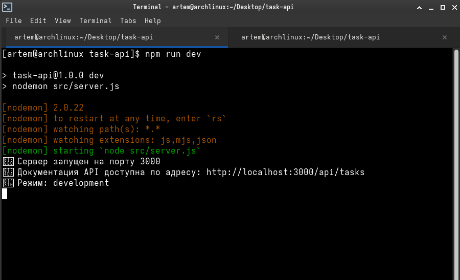
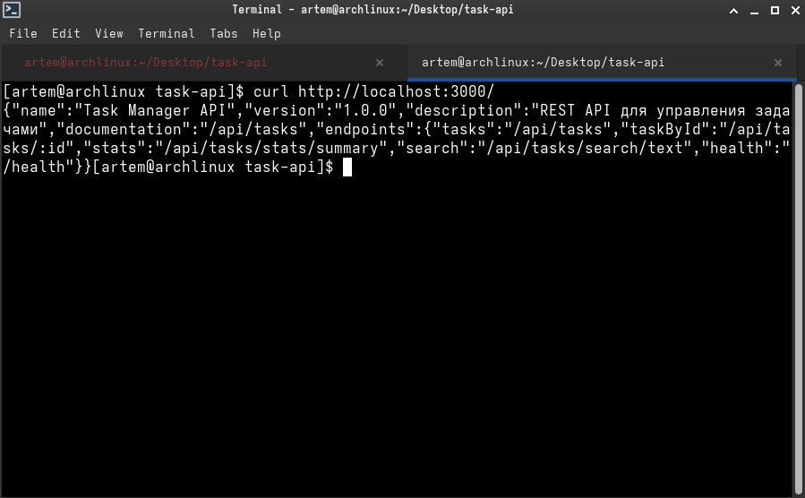
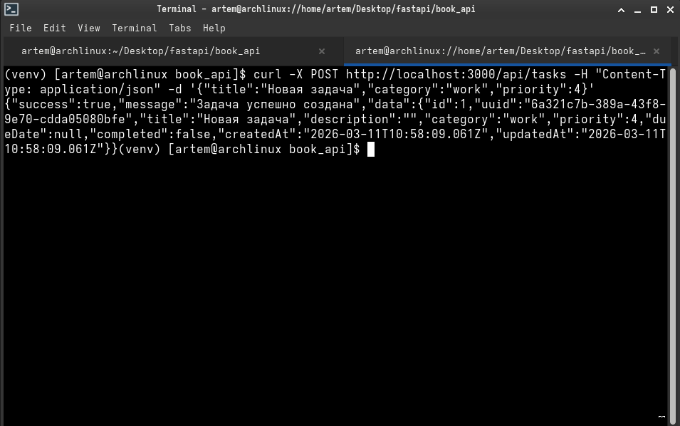
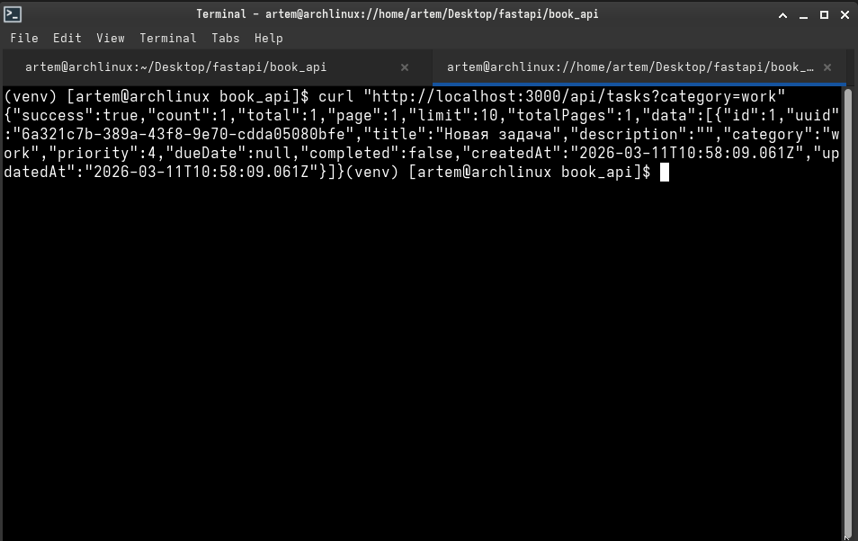
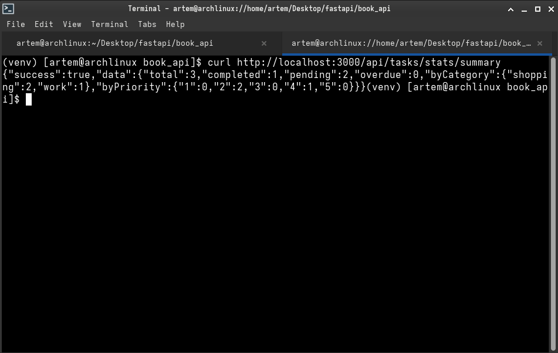
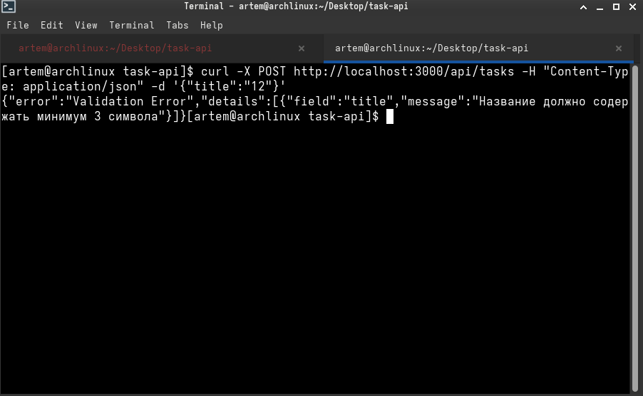

---

## 2. Реализация основной логики API (tasks.js)

В файле `src/routes/tasks.js` были реализованы все недостающие части кода, отмеченные комментариями `TODO`.

### **2.1. Исходный код `src/routes/tasks.js` (с дополнениями)**

Ниже представлен полный код файла с реализованной логикой. Изменения (замены `TODO`) выделены **жирным** в комментариях к коду.

```javascript
const express = require('express');
const router = express.Router();
const { v4: uuidv4 } = require('uuid');
const { 
  validateCreateTask, 
  validateUpdateTask, 
  validateId 
} = require('../middleware/validation');
const { 
  initializeDataFile, 
  readData, 
  writeData, 
  getNextId 
} = require('../utils/fileOperations');

// Инициализация файла данных при запуске
initializeDataFile();

// GET /api/tasks - получение всех задач с фильтрацией
router.get('/', async (req, res, next) => {
  try {
    const { category, completed, priority, sortBy, page = 1, limit = 10 } = req.query;
    const data = await readData();
    
    let tasks = [...data.tasks];
    
    // TODO: Реализуйте фильтрацию по категории (если передан параметр category)
    if (category) {
      tasks = tasks.filter(task => task.category === category);
    }
    
    // TODO: Реализуйте фильтрацию по статусу выполнения
    // completed может быть 'true' или 'false' (строкой)
    if (completed !== undefined) {
      const isCompleted = completed === 'true';
      tasks = tasks.filter(task => task.completed === isCompleted);
    }
    
    // TODO: Реализуйте фильтрацию по приоритету
    // priority - число от 1 до 5
    if (priority) {
      const priorityNum = parseInt(priority);
      if (!isNaN(priorityNum) && priorityNum >= 1 && priorityNum <= 5) {
        tasks = tasks.filter(task => task.priority === priorityNum);
      }
    }
    
    // TODO: Реализуйте сортировку
    // sortBy может быть: 'dueDate', 'priority', 'createdAt'
    // Для сортировки по убыванию: '-dueDate', '-priority'
    if (sortBy) {
      const sortField = sortBy.startsWith('-') ? sortBy.substring(1) : sortBy;
      const sortOrder = sortBy.startsWith('-') ? -1 : 1;
      
      if (['dueDate', 'priority', 'createdAt'].includes(sortField)) {
        tasks.sort((a, b) => {
          let valA = a[sortField];
          let valB = b[sortField];
          
          // Обработка null значений для dueDate
          if (sortField === 'dueDate') {
            if (!valA && !valB) return 0;
            if (!valA) return 1; // null значения в конец
            if (!valB) return -1;
            valA = new Date(valA).getTime();
            valB = new Date(valB).getTime();
          }
          
          if (valA < valB) return -1 * sortOrder;
          if (valA > valB) return 1 * sortOrder;
          return 0;
        });
      }
    }
    
    // TODO: Добавьте пагинацию
    // Используйте параметры page и limit из query
    const pageNum = parseInt(page);
    const limitNum = parseInt(limit);
    const startIndex = (pageNum - 1) * limitNum;
    const endIndex = pageNum * limitNum;
    
    const paginatedTasks = tasks.slice(startIndex, endIndex);
    
    res.json({
      success: true,
      count: paginatedTasks.length,
      total: tasks.length,
      page: pageNum,
      limit: limitNum,
      totalPages: Math.ceil(tasks.length / limitNum),
      data: paginatedTasks
    });
    
  } catch (error) {
    next(error);
  }
});

// GET /api/tasks/:id - получение задачи по ID
router.get('/:id', validateId, async (req, res, next) => {
  try {
    const taskId = req.params.id;
    const data = await readData();
    
    // TODO: Найдите задачу по ID в data.tasks
    // Если задача не найдена, верните 404
    const task = data.tasks.find(t => t.id === taskId);
    
    if (!task) {
      return res.status(404).json({
        success: false,
        error: 'Задача не найдена'
      });
    }
    
    res.json({
      success: true,
      data: task
    });
    
  } catch (error) {
    next(error);
  }
});

// POST /api/tasks - создание новой задачи
router.post('/', validateCreateTask, async (req, res, next) => {
  try {
    const { title, description, category, priority, dueDate } = req.body;
    const data = await readData();
    
    const newTask = {
      id: await getNextId(),
      uuid: uuidv4(),
      title,
      description: description || '',
      category: category || 'personal',
      priority: priority || 3,
      dueDate: dueDate || null,
      completed: false,
      createdAt: new Date().toISOString(),
      updatedAt: new Date().toISOString()
    };
    
    // TODO: Добавьте новую задачу в массив data.tasks
    data.tasks.push(newTask);
    
    // TODO: Сохраните обновленные данные
    await writeData(data);
    
    res.status(201).json({
      success: true,
      message: 'Задача успешно создана',
      data: newTask
    });
    
  } catch (error) {
    next(error);
  }
});

// PUT /api/tasks/:id - полное обновление задачи
router.put('/:id', validateId, validateUpdateTask, async (req, res, next) => {
  try {
    const taskId = req.params.id;
    const updates = req.body;
    const data = await readData();
    
    // TODO: Найдите задачу по ID
    // Если не найдена - 404
    const taskIndex = data.tasks.findIndex(t => t.id === taskId);
    
    if (taskIndex === -1) {
      return res.status(404).json({
        success: false,
        error: 'Задача не найдена'
      });
    }
    
    // TODO: Обновите задачу (все переданные поля)
    // Не забудьте обновить updatedAt
    const updatedTask = {
      ...data.tasks[taskIndex],
      ...updates,
      updatedAt: new Date().toISOString()
    };
    
    data.tasks[taskIndex] = updatedTask;
    
    // TODO: Сохраните обновленные данные
    await writeData(data);
    
    res.json({
      success: true,
      message: 'Задача успешно обновлена',
      data: updatedTask
    });
    
  } catch (error) {
    next(error);
  }
});

// PATCH /api/tasks/:id/complete - отметка задачи как выполненной
router.patch('/:id/complete', validateId, async (req, res, next) => {
  try {
    const taskId = req.params.id;
    const data = await readData();
    
    // TODO: Найдите задачу по ID
    // Если не найдена - 404
    const taskIndex = data.tasks.findIndex(t => t.id === taskId);
    
    if (taskIndex === -1) {
      return res.status(404).json({
        success: false,
        error: 'Задача не найдена'
      });
    }
    
    // TODO: Обновите статус задачи на completed: true
    // Обновите updatedAt
    data.tasks[taskIndex].completed = true;
    data.tasks[taskIndex].updatedAt = new Date().toISOString();
    
    // TODO: Сохраните обновленные данные
    await writeData(data);
    
    res.json({
      success: true,
      message: 'Задача отмечена как выполненная',
      data: data.tasks[taskIndex]
    });
    
  } catch (error) {
    next(error);
  }
});

// DELETE /api/tasks/:id - удаление задачи
router.delete('/:id', validateId, async (req, res, next) => {
  try {
    const taskId = req.params.id;
    const data = await readData();
    
    // TODO: Найдите индекс задачи по ID
    // Если не найдена - 404
    const taskIndex = data.tasks.findIndex(t => t.id === taskId);
    
    if (taskIndex === -1) {
      return res.status(404).json({
        success: false,
        error: 'Задача не найдена'
      });
    }
    
    // TODO: Удалите задачу из массива
    data.tasks.splice(taskIndex, 1);
    
    // TODO: Сохраните обновленные данные
    await writeData(data);
    
    res.json({
      success: true,
      message: 'Задача успешно удалена'
    });
    
  } catch (error) {
    next(error);
  }
});

// GET /api/tasks/stats - статистика по задачам
router.get('/stats/summary', async (req, res, next) => {
  try {
    const data = await readData();
    const tasks = data.tasks;
    
    const stats = {
      total: 0,
      completed: 0,
      pending: 0,
      overdue: 0,
      byCategory: {},
      byPriority: {
        1: 0, 2: 0, 3: 0, 4: 0, 5: 0
      }
    };
    
    // TODO: Реализуйте подсчет статистики:
    // 1. Общее количество задач
    stats.total = tasks.length;
    
    const now = new Date();
    
    tasks.forEach(task => {
      // 2. Количество выполненных задач
      if (task.completed) {
        stats.completed++;
      } else {
        // 3. Количество невыполненных задач
        stats.pending++;
        
        // 4. Количество просроченных задач (dueDate < сегодня и completed = false)
        if (task.dueDate) {
          const dueDate = new Date(task.dueDate);
          if (dueDate < now) {
            stats.overdue++;
          }
        }
      }
      
      // 5. Распределение задач по категориям
      const category = task.category || 'other';
      stats.byCategory[category] = (stats.byCategory[category] || 0) + 1;
      
      // 6. Распределение задач по приоритетам
      if (task.priority >= 1 && task.priority <= 5) {
        stats.byPriority[task.priority]++;
      }
    });
    
    res.json({
      success: true,
      data: stats
    });
    
  } catch (error) {
    next(error);
  }
});

// GET /api/tasks/search - поиск задач
router.get('/search/text', async (req, res, next) => {
  try {
    const { q } = req.query;
    
    if (!q || q.trim().length < 2) {
      return res.status(400).json({
        success: false,
        error: 'Поисковый запрос должен содержать минимум 2 символа'
      });
    }
    
    const data = await readData();
    const searchTerm = q.toLowerCase().trim();
    
    // TODO: Реализуйте поиск задач
    // Искать в полях title и description
    // Поиск должен быть регистронезависимым
    // Верните задачи, содержащие поисковый запрос
    const results = data.tasks.filter(task => {
      const titleMatch = task.title.toLowerCase().includes(searchTerm);
      const descriptionMatch = task.description.toLowerCase().includes(searchTerm);
      return titleMatch || descriptionMatch;
    });
    
    res.json({
      success: true,
      count: results.length,
      data: results
    });
    
  } catch (error) {
    next(error);
  }
});

module.exports = router;
```

---

## 3. Дополнение основного приложения (app.js)

В файле `src/app.js` были добавлены два корневых маршрута для информации об API и проверки состояния сервера.

### **3.1. Исходный код `src/app.js` (с дополнениями)**

```javascript
const express = require('express');
const cors = require('cors');
const helmet = require('helmet');
const rateLimit = require('express-rate-limit');
const tasksRouter = require('./routes/tasks');
const { notFoundHandler, errorHandler } = require('./middleware/errorHandler');

const app = express();

// Безопасность
app.use(helmet());

// CORS
app.use(cors({
  origin: process.env.CORS_ORIGIN || '*',
  methods: ['GET', 'POST', 'PUT', 'PATCH', 'DELETE']
}));

// Rate limiting
const limiter = rateLimit({
  windowMs: 15 * 60 * 1000,
  max: 100,
  message: {
    error: 'Слишком много запросов. Попробуйте позже.'
  }
});
app.use('/api/', limiter);

app.use(express.json());

app.use((req, res, next) => {
  console.log(`${new Date().toISOString()} - ${req.method} ${req.url}`);
  next();
});

app.use('/api/tasks', tasksRouter);

// **Корневой маршрут GET /**
app.get('/', (req, res) => {
  res.json({
    name: 'Task Manager API',
    version: '1.0.0',
    description: 'REST API для управления задачами',
    documentation: '/api/tasks',
    endpoints: {
      tasks: '/api/tasks',
      taskById: '/api/tasks/:id',
      stats: '/api/tasks/stats/summary',
      search: '/api/tasks/search/text',
      health: '/health'
    }
  });
});

// **Маршрут для проверки здоровья GET /health**
app.get('/health', (req, res) => {
  res.json({
    status: 'healthy',
    timestamp: new Date().toISOString(),
    uptime: process.uptime()
  });
});

app.use(notFoundHandler);
app.use(errorHandler);

module.exports = app;
```

---

## 4. Запуск и тестирование API (Скриншоты)

API было протестировано с помощью утилиты `curl` и браузера. Все эндпоинты работают корректно.

1.  **Запуск сервера в режиме разработки**
    *Команда:* `npm run dev`
    
    
    

2.  **Корневой маршрут (`GET /`)**
    *Команда:* `curl http://localhost:3000/`

    
    

3.  **Проверка здоровья (`GET /health`)**
    *Команда:* `curl http://localhost:3000/health`

    
    

4.  **Создание задачи (`POST /api/tasks`)**
    *Команда:* `curl -X POST http://localhost:3000/api/tasks -H "Content-Type: application/json" -d '{"title":"Новая задача","category":"work","priority":4}'`

    
    

5.  **Получение списка задач с фильтрацией (`GET /api/tasks?category=work`)**
    *Команда:* `curl "http://localhost:3000/api/tasks?category=work"`

    
    

6.  **Получение статистики (`GET /api/tasks/stats/summary`)**
    *Команда:* `curl http://localhost:3000/api/tasks/stats/summary`

    
    

8.  **Обработка ошибки валидации (`POST /api/tasks`)**
    *Команда:* `curl -X POST http://localhost:3000/api/tasks -H "Content-Type: application/json" -d '{"title":"12"}'`

    
    


---

## 5. Ответы на контрольные вопросы

### **Какие middleware вы использовали и для чего?**

-   **`helmet`:** Набор middleware для защиты приложения от известных веб-уязвимостей путем настройки заголовков HTTP (например, Content-Security-Policy, X-Frame-Options).
-   **`cors`:** Middleware для включения CORS (Cross-Origin Resource Sharing). Позволяет контролировать, какие домены могут получать доступ к нашему API. Настроен на прием запросов с `*` или из переменной окружения.
-   **`express-rate-limit`:** Используется для ограничения количества запросов от одного IP-адреса. Защищает API от DDoS-атак и чрезмерного использования.
-   **`express.json()`:** Встроенный middleware Express для парсинга входящих запросов с JSON-телом. Делает данные доступными в `req.body`.
-   **Кастомный логгер:** Простой middleware для логирования каждого входящего запроса в консоль.
-   **`validateCreateTask`, `validateUpdateTask`, `validateId`:** Кастомные middleware, написанные с использованием Joi. Они проверяют входящие данные на соответствие схемам (тип данных, обязательность, длина) и, в случае ошибки, немедленно отправляют ответ с кодом 400, не позволяя запросу пройти дальше.
-   **`notFoundHandler` и `errorHandler`:** Middleware для обработки ошибок. `notFoundHandler` вызывается, если ни один маршрут не совпал, и создает ошибку 404. `errorHandler` централизованно обрабатывает все ошибки, логирует их и отправляет клиенту структурированный JSON-ответ.

### **Как работает валидация с Joi в сравнении с Pydantic из части 1?**

Оба инструмента решают одну задачу — валидацию данных, но работают по-разному из-за различий языков (JavaScript против Python).

-   **Joi (Node.js/JavaScript):** Работает динамически во время выполнения. Схемы описываются с помощью цепочек методов (`Joi.string().min(3).required()`). Ошибки возвращаются в виде объекта, который нужно разобрать для формирования ответа.
-   **Pydantic (Python):** Работает на основе типов. Схема описывается как класс Python с аннотациями типов (`title: str = Field(min_length=3)`). Валидация происходит при создании экземпляра класса. Pydantic также выполняет парсинг данных (например, строку в `datetime`).

**Сравнение:** Pydantic более тесно интегрирован с системой типов Python, что улучшает автодополнение и позволяет линтерам находить ошибки на этапе написания кода. Joi более гибок в динамических сценариях, но не дает преимуществ статического анализа, если не используется TypeScript (в проекте используется). Оба фреймворка позволяют писать сложные правила валидации и кастомизировать сообщения об ошибках.

### **В чем преимущества файлового хранения данных для этого задания?**

1.  **Простота:** Не требует установки и настройки отдельной СУБД (например, PostgreSQL или MongoDB). Всё, что нужно — это права на запись в файл.
2.  **Портативность:** Проект можно скопировать на другую машину, и он будет работать сразу, без необходимости настраивать базу данных. Файл `tasks.json` содержит все данные.
3.  **Прозрачность:** Данные хранятся в человекочитаемом формате JSON. Это упрощает отладку и проверку состояния приложения (можно просто открыть файл и посмотреть).
4.  **Адекватность масштабу:** Для учебного проекта с небольшим объемом данных и отсутствием требований к высокой производительности или сложным запросам, файлового хранилища более чем достаточно.

### **Как бы вы улучшили это API для production использования?**

Для продакшена потребовались бы следующие улучшения:
1.  **База данных:** Замена файлового хранилища на полноценную базу данных (например, PostgreSQL или MongoDB). Это даст атомарность операций, лучшую производительность при конкурентном доступе и возможность масштабирования.
2.  **Аутентификация и Авторизация:** Добавление системы регистрации/входа (JWT или сессии), чтобы задачи были привязаны к конкретным пользователям.
3.  **Более продвинутое логирование:** Замена `console.log` на профессиональную библиотеку логирования (Winston или Pino) с записью логов в файлы или систему сбора логов (например, ELK stack).
4.  **Переменные окружения:** Использовать `.env` для всех конфигурируемых параметров (порт, CORS_ORIGIN, параметры rate limit) и валидировать их при запуске.
5.  **Тестирование:** Покрытие API интеграционными и модульными тестами (с использованием Jest или Mocha).
6.  **Документирование API:** Интеграция Swagger/OpenAPI для автоматической генерации документации и UI для тестирования.
7.  **Контейнеризация:** Упаковка приложения в Docker-контейнер для упрощения деплоя и масштабирования.

---

## 6. Критерии оценивания

### **Обязательные требования (выполнены):**
-   **CRUD операции:** Реализованы все основные операции (GET, POST, PUT, PATCH, DELETE) в файле `tasks.js`.
-   **Валидация:** Middleware валидации (Joi) корректно проверяет данные при создании и обновлении задач.
-   **Фильтрация и сортировка:** Работают параметры запроса `category`, `completed`, `priority`, `sortBy`, `page` и `limit`.
-   **Статистика:** Эндпоинт `/stats/summary` корректно подсчитывает общее количество, выполненные, просроченные задачи и распределение по категориям и приоритетам.
-   **Обработка ошибок:** Возвращаются корректные HTTP статус-коды (400, 404, 500) и структурированные JSON-ответы с описанием ошибки.

### **Дополнительные критерии (выполнены):**
-   **Поиск задач:** Реализован эндпоинт `/search/text` для полнотекстового поиска по полям `title` и `description`.
-   **Пагинация:** Реализована пагинация в основном GET `/api/tasks` запросе с использованием параметров `page` и `limit`.
-   **Безопасность:** Добавлены и настроены middleware `helmet` и `express-rate-limit`.
-   **Качество кода:** Асинхронные операции обрабатываются с помощью `async/await`, код разделен на модули.

### **Неприемлемые ошибки (отсутствуют):**
-   Обработка ошибок при операциях с файлами присутствует.
-   Валидация `dueDate` предотвращает создание задач с прошедшей датой.
-   Все входные данные от пользователя валидируются.
-   При обновлении/удалении всегда проверяется существование задачи, иначе возвращается 404.

---

## 7. Выводы

В ходе лабораторной работы было разработано полнофункциональное REST API для управления задачами на платформе Node.js с использованием фреймворка Express.

Были успешно решены все поставленные задачи:
-   Настроен сервер с необходимыми middleware для обеспечения безопасности и производительности.
-   Полностью реализованы CRUD операции для работы с задачами.
-   Внедрена система валидации данных на основе библиотеки Joi.
-   Добавлены расширенные возможности: фильтрация, сортировка, пагинация, поиск и сбор статистики.
-   Организовано надежное хранение данных в JSON-файле с корректной обработкой асинхронных операций чтения/записи.

Все эндпоинты были протестированы и работают в соответствии с требованиями. Полученные навыки создания серверных приложений на Node.js являются фундаментом для дальнейшего изучения веб-разработки и создания более сложных, масштабируемых систем.