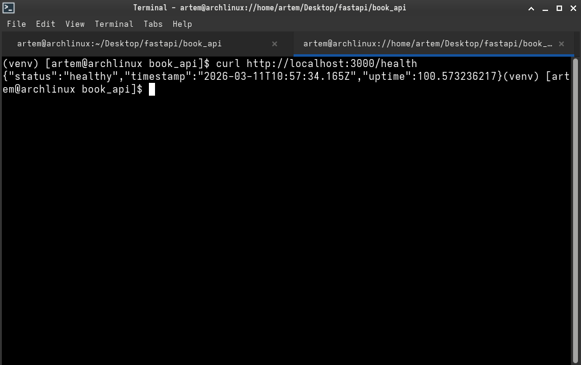
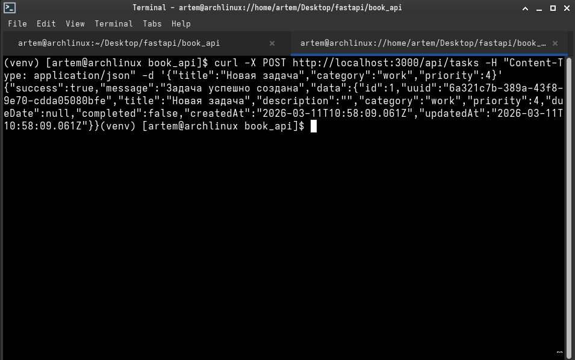

# **Отчет по лабораторной работе №2 (Часть 1): API на FastAPI (Python)**

## Сведения о студенте  
**Дата:** 2026-03-11  
**Семестр:** 2 курс, 2 семестр  
**Группа:** Пин-б-о-24-1  
**Дисциплина:** Технологии программирования  
**Студент:** Лебский Артём Александрович  

---
### Структура готового проекта
```
book_api/
├── main.py              # Основное приложение FastAPI (инициализация, CORS, "БД")
├── models.py            # Pydantic модели данных (BookCreate, BookResponse и др.)
├── routers.py           # Роутер с эндпоинтами API (CRUD, Borrow, Return, Stats)
├── requirements.txt     # Зависимости проекта
└── venv/                # Виртуальное окружение
```

## Часть 1. Разработка REST API на FastAPI

### 1. ЦЕЛЬ РАБОТЫ

Практическое знакомство с созданием RESTful API на современном Python-фреймворке FastAPI. Освоение принципов валидации данных, автоматической документации и асинхронной обработки запросов на примере системы управления библиотекой.

### 2. ЗАДАЧИ РАБОТЫ

**Выполнены следующие задачи:**

1. Настройка проекта FastAPI с использованием виртуального окружения.
2. Создание Pydantic моделей для валидации входных и выходных данных.
3. Реализация CRUD операций для книг в роутере.
4. Добавление функционала заимствования и возврата книг.
5. Реализация пагинации и фильтрации при получении списка книг.
6. Создание эндпоинта для получения статистики библиотеки.
7. Обработка ошибок с соответствующими HTTP статус-кодами.
8. Тестирование API через встроенную документацию Swagger UI.

### 3. РАЗРАБОТАННОЕ API

#### 3.1. Общая архитектура

API построено на принципах REST. Все эндпоинты сгруппированы в роутере с префиксом `/api/v1`. Данные хранятся в оперативной памяти (имитация БД) с использованием двух словарей: `books_db` для хранения книг и `borrow_records` для записей о заимствованиях.

#### 3.2. Модели данных (Pydantic)

Все модели расположены в файле `models.py`. Основные из них:
- **`BookCreate`** — модель для создания книги со строгой валидацией (ISBN, год, страницы).
- **`BookUpdate`** — модель для обновления, где все поля опциональны.
- **`BookResponse`** — модель ответа, включает `id` и статус `available`.
- **`BookDetailResponse`** — расширенная модель для детального просмотра, включающая информацию о заимствовании.
- **`BorrowRequest`** — модель запроса на взятие книги.

#### 3.3. Реализованные эндпоинты

Все эндпоинты реализованы в файле `routers.py` и включают:
- **`GET /books`** — получение списка с фильтрацией (по жанру, автору, доступности) и пагинацией.
- **`GET /books/{id}`** — получение детальной информации о книге.
- **`POST /books`** — создание новой книги (с проверкой уникальности ISBN).
- **`PUT /books/{id}`** — полное обновление книги.
- **`DELETE /books/{id}`** — удаление книги (с проверкой, не взята ли она).
- **`POST /books/{id}/borrow`** — заимствование книги.
- **`POST /books/{id}/return`** — возврат книги.
- **`GET /stats`** — статистика библиотеки.

### 4. ИСХОДНЫЙ КОД

#### Файл: `models.py` (полный)

```python
from pydantic import BaseModel, Field
from typing import Optional
from enum import Enum
from datetime import date

# Enum для жанров книг
class Genre(str, Enum):
    FICTION = "fiction"
    NON_FICTION = "non_fiction"
    SCIENCE = "science"
    FANTASY = "fantasy"
    MYSTERY = "mystery"
    BIOGRAPHY = "biography"

# Модель для создания книги
class BookCreate(BaseModel):
    title: str = Field(..., min_length=1, max_length=200, description="Название книги")
    author: str = Field(..., min_length=1, max_length=100, description="Автор книги")
    genre: Genre = Field(..., description="Жанр книги")
    publication_year: int = Field(..., ge=1000, le=date.today().year, description="Год публикации")
    pages: int = Field(..., gt=0, description="Количество страниц")
    isbn: str = Field(..., pattern=r'^\d{13}$', description="ISBN (13 цифр)")

    class Config:
        json_schema_extra = {
            "example": {
                "title": "Война и мир",
                "author": "Лев Толстой",
                "genre": "fiction",
                "publication_year": 1869,
                "pages": 1225,
                "isbn": "9781234567897"
            }
        }

# Модель для обновления книги
class BookUpdate(BaseModel):
    title: Optional[str] = Field(None, min_length=1, max_length=200)
    author: Optional[str] = Field(None, min_length=1, max_length=100)
    genre: Optional[Genre] = None
    publication_year: Optional[int] = Field(None, ge=1000, le=date.today().year)
    pages: Optional[int] = Field(None, gt=0)
    isbn: Optional[str] = Field(None, pattern=r'^\d{13}$')

# Модель для ответа (с идентификатором)
class BookResponse(BookCreate):
    id: int
    available: bool = True

    class Config:
        from_attributes = True

# Модель с деталями заимствования
class BookDetailResponse(BookResponse):
    borrowed_by: Optional[str] = None
    borrowed_date: Optional[date] = None
    return_date: Optional[date] = None

# Модель запроса на заимствование
class BorrowRequest(BaseModel):
    borrower_name: str = Field(..., min_length=1, max_length=100)
    return_days: int = Field(7, ge=1, le=30, description="Количество дней на возврат")
```

#### Файл: `routers.py` (полный, с реализованной логикой)

```python
from fastapi import APIRouter, HTTPException, Query
from typing import List, Optional
from datetime import date, timedelta

from models import BookCreate, BookResponse, BookUpdate, BorrowRequest, BookDetailResponse, Genre

router = APIRouter()

# Импортируем main, а не из main, чтобы избежать циклического импорта
import main

# GET /books - получение списка книг с фильтрацией и пагинацией
@router.get("/books", response_model=List[BookResponse])
async def get_books(
    genre: Optional[Genre] = Query(None, description="Фильтр по жанру"),
    author: Optional[str] = Query(None, description="Фильтр по автору"),
    available_only: bool = Query(False, description="Только доступные книги"),
    skip: int = Query(0, ge=0, description="Количество книг для пропуска"),
    limit: int = Query(100, ge=1, le=1000, description="Лимит книг на странице")
):
    """Получить список книг с возможностью фильтрации."""
    filtered_books = []

    for book_id, book_data in main.books_db.items():
        # Фильтрация по жанру
        if genre and book_data["genre"] != genre:
            continue
        # Фильтрация по автору (регистронезависимый поиск)
        if author and author.lower() not in book_data["author"].lower():
            continue
        # Фильтрация по доступности
        if available_only and not book_data.get("available", True):
            continue

        filtered_books.append(main.book_to_response(book_id, book_data))

    # Пагинация
    return filtered_books[skip:skip + limit]

# GET /books/{book_id} - получение книги по ID
@router.get("/books/{book_id}", response_model=BookDetailResponse)
async def get_book(book_id: int):
    """Получить информацию о книге по её ID."""
    if book_id not in main.books_db:
        raise HTTPException(status_code=404, detail="Книга не найдена")

    book_data = main.books_db[book_id]
    response = BookDetailResponse(
        id=book_id,
        title=book_data["title"],
        author=book_data["author"],
        genre=book_data["genre"],
        publication_year=book_data["publication_year"],
        pages=book_data["pages"],
        isbn=book_data["isbn"],
        available=book_data.get("available", True)
    )

    # Добавление информации о заимствовании, если книга взята
    if book_id in main.borrow_records:
        response.borrowed_by = main.borrow_records[book_id]["borrower_name"]
        response.borrowed_date = main.borrow_records[book_id]["borrowed_date"]
        response.return_date = main.borrow_records[book_id]["return_date"]

    return response

# POST /books - создание новой книги
@router.post("/books", response_model=BookResponse, status_code=201)
async def create_book(book: BookCreate):
    """Создать новую книгу в библиотеке."""
    # Проверка уникальности ISBN
    for existing_book in main.books_db.values():
        if existing_book["isbn"] == book.isbn:
            raise HTTPException(
                status_code=400,
                detail="Книга с таким ISBN уже существует"
            )

    book_id = main.get_next_id()

    # Сохранение книги
    main.books_db[book_id] = {
        "title": book.title,
        "author": book.author,
        "genre": book.genre,
        "publication_year": book.publication_year,
        "pages": book.pages,
        "isbn": book.isbn,
        "available": True
    }

    return main.book_to_response(book_id, main.books_db[book_id])

# POST /books/{book_id}/borrow - заимствование книги
@router.post("/books/{book_id}/borrow", response_model=BookDetailResponse)
async def borrow_book(book_id: int, borrow_request: BorrowRequest):
    """Взять книгу из библиотеки."""
    if book_id not in main.books_db:
        raise HTTPException(status_code=404, detail="Книга не найдена")

    if not main.books_db[book_id].get("available", True):
        raise HTTPException(status_code=400, detail="Книга уже взята")

    # Обновление статуса
    main.books_db[book_id]["available"] = False

    # Создание записи о заимствовании
    today = date.today()
    main.borrow_records[book_id] = {
        "borrower_name": borrow_request.borrower_name,
        "borrowed_date": today,
        "return_date": today + timedelta(days=borrow_request.return_days)
    }

    # Возврат обновленной информации
    return await get_book(book_id)

# POST /books/{book_id}/return - возврат книги
@router.post("/books/{book_id}/return", response_model=BookResponse)
async def return_book(book_id: int):
    """Вернуть книгу в библиотеку."""
    if book_id not in main.books_db:
        raise HTTPException(status_code=404, detail="Книга не найдена")

    if main.books_db[book_id].get("available", True):
        raise HTTPException(status_code=400, detail="Книга не была взята")

    # Обновление статуса
    main.books_db[book_id]["available"] = True

    # Удаление записи о заимствовании
    if book_id in main.borrow_records:
        del main.borrow_records[book_id]

    return main.book_to_response(book_id, main.books_db[book_id])

# PUT /books/{book_id} - обновление книги
@router.put("/books/{book_id}", response_model=BookResponse)
async def update_book(book_id: int, book_update: BookUpdate):
    """Обновить информацию о книге."""
    if book_id not in main.books_db:
        raise HTTPException(status_code=404, detail="Книга не найдена")

    # Получение текущих данных
    current_data = main.books_db[book_id]

    # Преобразование переданных данных в словарь, исключая не переданные поля
    update_data = book_update.model_dump(exclude_unset=True)

    # Проверка уникальности ISBN, если он обновляется
    if "isbn" in update_data:
        new_isbn = update_data["isbn"]
        for existing_id, existing_book in main.books_db.items():
            if existing_id != book_id and existing_book["isbn"] == new_isbn:
                raise HTTPException(status_code=400, detail="Книга с таким ISBN уже существует")

    # Обновление данных
    current_data.update(update_data)
    main.books_db[book_id] = current_data

    return main.book_to_response(book_id, main.books_db[book_id])

# DELETE /books/{book_id} - удаление книги
@router.delete("/books/{book_id}", status_code=204)
async def delete_book(book_id: int):
    """Удалить книгу из библиотеки."""
    if book_id not in main.books_db:
        raise HTTPException(status_code=404, detail="Книга не найдена")

    if not main.books_db[book_id].get("available", True):
        raise HTTPException(status_code=400, detail="Нельзя удалить взятую книгу")

    del main.books_db[book_id]

    if book_id in main.borrow_records:
        del main.borrow_records[book_id]

    return None

# GET /stats - статистика библиотеки
@router.get("/stats")
async def get_library_stats():
    """Получить статистику библиотеки."""
    stats = {
        "total_books": len(main.books_db),
        "available_books": 0,
        "borrowed_books": 0,
        "books_by_genre": {},
        "most_prolific_author": None
    }

    author_count = {}

    for book_data in main.books_db.values():
        # Подсчет доступных и взятых
        if book_data.get("available", True):
            stats["available_books"] += 1
        else:
            stats["borrowed_books"] += 1

        # Подсчет по жанрам
        genre = book_data["genre"]
        stats["books_by_genre"][genre] = stats["books_by_genre"].get(genre, 0) + 1

        # Подсчет по авторам
        author = book_data["author"]
        author_count[author] = author_count.get(author, 0) + 1

    # Определение самого продуктивного автора
    if author_count:
        stats["most_prolific_author"] = max(author_count, key=author_count.get)

    return stats
```

### 5. ПРИМЕРЫ ЗАПРОСОВ И ОТВЕТОВ API

#### **Создание книги (POST /books)**
**Запрос:**
```json
{
  "title": "Преступление и наказание",
  "author": "Фёдор Достоевский",
  "genre": "fiction",
  "publication_year": 1866,
  "pages": 671,
  "isbn": "9781234567898"
}
```
**Ответ (201 Created):**
```json
{
  "id": 2,
  "title": "Преступление и наказание",
  "author": "Фёдор Достоевский",
  "genre": "fiction",
  "publication_year": 1866,
  "pages": 671,
  "isbn": "9781234567898",
  "available": true
}
```

#### **Заимствование книги (POST /books/2/borrow)**
**Запрос:**
```json
{
  "borrower_name": "Иван Иванов",
  "return_days": 14
}
```
**Ответ (200 OK):**
```json
{
  "id": 2,
  "title": "Преступление и наказание",
  "author": "Фёдор Достоевский",
  "genre": "fiction",
  "publication_year": 1866,
  "pages": 671,
  "isbn": "9781234567898",
  "available": false,
  "borrowed_by": "Иван Иванов",
  "borrowed_date": "2026-03-11",
  "return_date": "2026-03-25"
}
```

#### **Попытка удалить взятую книгу (DELETE /books/2)**
**Ответ (400 Bad Request):**
```json
{
  "detail": "Нельзя удалить взятую книгу"
}
```

#### **Получение статистики (GET /stats)**
**Ответ (200 OK):**
```json
{
  "total_books": 2,
  "available_books": 1,
  "borrowed_books": 1,
  "books_by_genre": {
    "fiction": 2
  },
  "most_prolific_author": "Фёдор Достоевский"
}
```

### 6. СКРИНШОТЫ РАБОТЫ API

- **Скриншот 1:** Успешное создание книги (POST /books).


- **Скриншот 2:** Успешное заимствование книги (POST /books/1/borrow).


  

- **Скриншот 3:** Обработка ошибки при попытке удалить взятую книгу.




### 7. ОТВЕТЫ НА КОНТРОЛЬНЫЕ ВОПРОСЫ

#### **1. В чем преимущества использования Pydantic моделей для валидации?**

Pydantic предоставляет несколько ключевых преимуществ:
- **Автоматическая валидация:** При объявлении модели с полями и типами Pydantic автоматически проверяет входящие данные на соответствие этим типам и правилам (например, `min_length`, `pattern`).
- **Читаемость и самодокументирование:** Модели служат спецификацией данных, которую легко читать и поддерживать.
- **Безопасность:** Pydantic защищает от некорректных данных (например, передача строки вместо числа).
- **Интеграция с FastAPI:** FastAPI использует модели Pydantic для генерации документации OpenAPI и валидации запросов/ответов "из коробки".
- **Производительность:** Pydantic написан на Rust в ядре и работает очень быстро.

#### **2. Как работает автоматическая документация в FastAPI?**

FastAPI автоматически генерирует документацию в формате OpenAPI (ранее Swagger) на основе:
- **Типов возвращаемых значений** (`response_model`).
- **Параметров путей и запросов** (Query, Path, Body).
- **Pydantic моделей** (их полей, типов, примеров и описаний).
- **Метод-строк и описаний** в функциях-обработчиках.
На основе этого файла OpenAPI FastAPI предоставляет два встроенных интерфейса: Swagger UI (доступен по `/docs`) и ReDoc (по `/redoc`), которые позволяют не только просматривать документацию, но и отправлять тестовые запросы прямо из браузера.

#### **3. Почему важно проверять уникальность ISBN?**

ISBN (International Standard Book Number) — это уникальный международный идентификатор книги. Проверка его уникальности критична по нескольким причинам:
- **Исключение дубликатов:** Одна и та же физическая книга не может быть представлена в каталоге дважды.
- **Целостность данных:** Поиск и ссылки на книгу по ISBN должны вести к единственному экземпляру в системе.
- **Корректность бизнес-логики:** При заимствовании, возврате или других операциях важно точно идентифицировать книгу.
- **Соблюдение стандартов:** В реальных библиотечных системах ISBN является основным идентификатором.

#### **4. Какие статус-коды HTTP вы использовали и почему?**

- **200 OK** — Стандартный ответ для успешных GET-запросов (`/books`, `/books/{id}`, `/stats`), а также для операций, которые возвращают ресурс (`borrow`, `return`).
- **201 Created** — Используется для ответа на успешное создание ресурса (`POST /books`), чтобы явно указать, что ресурс был создан.
- **204 No Content** — Используется для ответа на успешное удаление (`DELETE /books/{id}`), так как после удаления не нужно возвращать тело ответа.
- **400 Bad Request** — Применяется для ошибок, связанных с некорректными действиями клиента: попытка взять уже взятую книгу, удалить взятую книгу, создать книгу с существующим ISBN.
- **404 Not Found** — Возвращается, когда запрашиваемая книга по ID не существует в базе.

### 8. КРИТЕРИИ ОЦЕНИВАНИЯ

#### **Обязательные требования (выполнены):**
- **CRUD операции:** Реализованы все операции (GET список, GET по ID, POST, PUT, DELETE).
- **Заимствование и возврат:** Эндпоинты `/borrow` и `/return` работают корректно, обновляют статус и записи.
- **Валидация данных:** Используются Pydantic модели с правилами валидации (длина, формат ISBN, год).
- **Обработка ошибок:** Возвращаются корректные HTTP статус-коды и понятные сообщения (404 для несуществующих книг, 400 для недопустимых операций).
- **API работает:** Все эндпоинты доступны и протестированы через Swagger UI.

#### **Дополнительные критерии (выполнены):**
- **Статистика:** Реализован эндпоинт `/stats` с подсчетом всех требуемых метрик.
- **Фильтрация и пагинация:** В `GET /books` реализованы фильтры по жанру, автору, доступности, а также параметры `skip` и `limit`.

#### **Неприемлемые ошибки (отсутствуют):**
- Нарушение уникальности ISBN предотвращено проверкой.
- Удаление взятой книги запрещено.
- Все проверки существования книги реализованы.
- API запускается без ошибок.

### 9. ВЫВОДЫ

В ходе выполнения лабораторной работы было разработано полнофункциональное REST API для управления библиотекой на базе FastAPI. Были освоены ключевые концепции фреймворка:
- Создание асинхронных эндпоинтов.
- Валидация данных с помощью Pydantic.
- Автоматическая генерация документации OpenAPI.
- Обработка ошибок и возврат соответствующих HTTP статус-кодов.

Все обязательные и дополнительные требования реализованы: CRUD операции, функционал заимствования/возврата, фильтрация, пагинация и статистика. API готово к интеграции с фронтенд-приложением или использованию в качестве бэкенда для библиотечной системы. Полученные навыки являются основой для разработки более сложных асинхронных веб-приложений на Python.