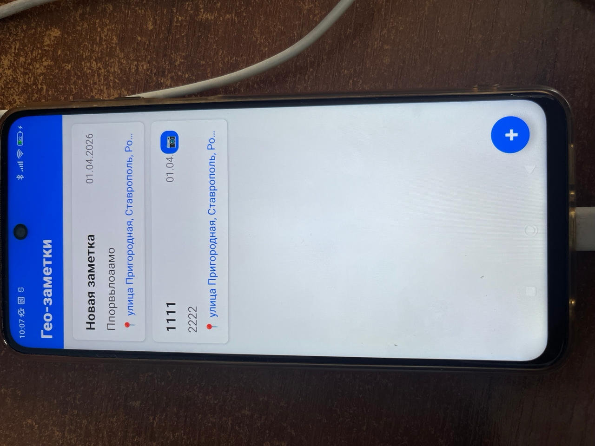
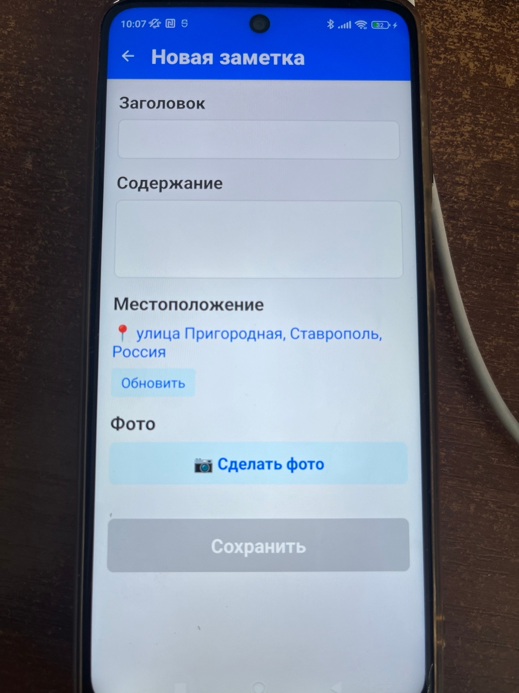
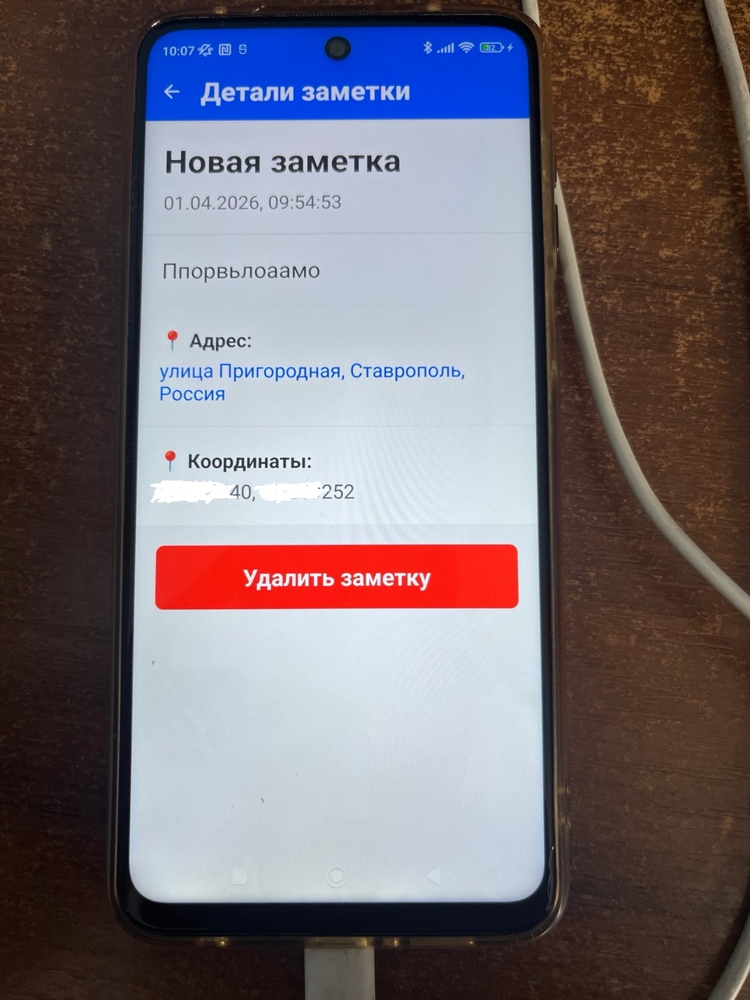
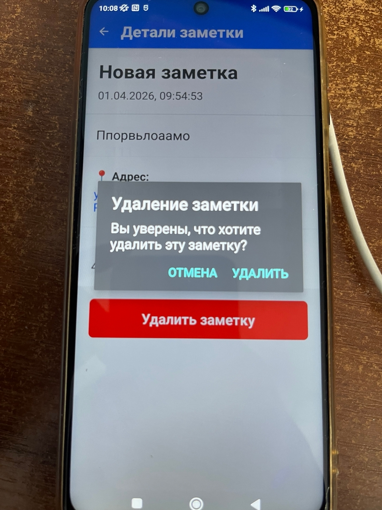
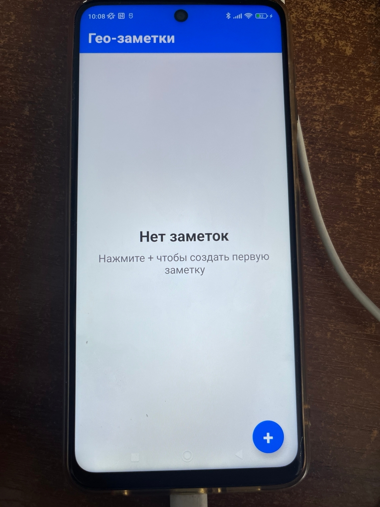

# **Отчет по лабораторной работе lab1202-React Native: Кроссплатформенная разработка с React Native**

## Сведения о студенте
**Дата:** 2026-04-01
**Семестр:** 2 курс, 2 семестр
**Группа:** Пин-б-о-24-1
**Дисциплина:** Технологии программирования
**Студент:** Лебский Артём Александрович

---

## 1. ЦЕЛЬ РАБОТЫ

Получить практические навыки создания кроссплатформенного мобильного приложения на React Native, изучить архитектуру с мостом (Bridge), научиться работать с нативными модулями через Expo и реализовать общую кодовую базу для Android и iOS.

---

## 2. ЗАДАЧИ РАБОТЫ

1. Настроить проект Expo с TypeScript
2. Реализовать CRUD операции с SQLite базой данных
3. Создать Redux Store для управления состоянием
4. Реализовать навигацию между экранами
5. Интегрировать геолокацию для получения текущего местоположения
6. Добавить функционал камеры для прикрепления фото
7. Отобразить заметки на карте
8. Обеспечить кроссплатформенность кода

---

## 3. РЕЗУЛЬТАТЫ РАЗРАБОТКИ

### 3.1. Структура проекта

```
GeoNotesNew/
├── src/
│   ├── types/
│   │   └── index.ts              # Типы данных GeoNote
│   ├── utils/
│   │   └── database.ts           # CRUD операции с SQLite
│   ├── store/
│   │   ├── index.ts              # Конфигурация Redux Store
│   │   └── notesSlice.ts         # Redux slice для заметок
│   ├── hooks/
│   │   └── reduxHooks.ts         # Типизированные хуки Redux
│   └── screens/
│       ├── NotesListScreen.tsx   # Экран списка заметок
│       ├── AddNoteScreen.tsx     # Экран создания заметки
│       └── NoteDetailScreen.tsx  # Экран деталей заметки
├── App.tsx                       # Главный компонент
├── index.js                      # Точка входа
├── package.json
└── tsconfig.json
```

### 3.2. Реализация базы данных (CRUD)

**Файл: src/utils/database.ts**

```typescript
import * as SQLite from 'expo-sqlite';
import { GeoNote } from '../types';

const db = SQLite.openDatabaseSync('geonotes.db');

// Инициализация базы данных
export const initDatabase = async (): Promise<void> => {
    try {
        await db.execAsync(`
            CREATE TABLE IF NOT EXISTS notes (
                id TEXT PRIMARY KEY NOT NULL,
                title TEXT NOT NULL,
                content TEXT NOT NULL,
                latitude REAL NOT NULL,
                longitude REAL NOT NULL,
                address TEXT,
                photoUri TEXT,
                createdAt INTEGER NOT NULL
            );
        `);
        console.log('Database initialized');
    } catch (error) {
        console.error('Database initialization error:', error);
        throw error;
    }
};

// Получение всех заметок
export const getNotes = async (): Promise<GeoNote[]> => {
    try {
        const result = await db.getAllAsync('SELECT * FROM notes ORDER BY createdAt DESC');
        return result as GeoNote[];
    } catch (error) {
        console.error('Get notes error:', error);
        throw error;
    }
};

// Добавление заметки
export const addNote = async (note: GeoNote): Promise<void> => {
    try {
        await db.runAsync(
            'INSERT INTO notes (id, title, content, latitude, longitude, address, photoUri, createdAt) VALUES (?, ?, ?, ?, ?, ?, ?, ?)',
            [note.id, note.title, note.content, note.latitude, note.longitude, note.address || null, note.photoUri || null, note.createdAt]
        );
    } catch (error) {
        console.error('Add note error:', error);
        throw error;
    }
};

// Удаление заметки
export const deleteNote = async (id: string): Promise<void> => {
    try {
        await db.runAsync('DELETE FROM notes WHERE id = ?', [id]);
    } catch (error) {
        console.error('Delete note error:', error);
        throw error;
    }
};

// Обновление заметки
export const updateNote = async (note: GeoNote): Promise<void> => {
    try {
        await db.runAsync(
            'UPDATE notes SET title = ?, content = ?, address = ?, photoUri = ? WHERE id = ?',
            [note.title, note.content, note.address || null, note.photoUri || null, note.id]
        );
    } catch (error) {
        console.error('Update note error:', error);
        throw error;
    }
};
```

### 3.3. Redux Slice с асинхронными операциями

**Файл: src/store/notesSlice.ts**

```typescript
import { createSlice, createAsyncThunk, PayloadAction } from '@reduxjs/toolkit';
import { GeoNote } from '../types';
import * as database from '../utils/database';

// Асинхронные действия (thunks)
export const loadNotes = createAsyncThunk(
    'notes/loadNotes',
    async () => {
        const notes = await database.getNotes();
        return notes;
    }
);

export const saveNote = createAsyncThunk(
    'notes/saveNote',
    async (note: GeoNote) => {
        // TODO: Реализовать сохранение в БД
        await database.addNote(note);
        return note;
    }
);

export const removeNote = createAsyncThunk(
    'notes/removeNote',
    async (id: string) => {
        // TODO: Реализовать удаление из БД
        await database.deleteNote(id);
        return id;
    }
);

interface NotesState {
    items: GeoNote[];
    loading: boolean;
    error: string | null;
}

const initialState: NotesState = {
    items: [],
    loading: false,
    error: null
};

const notesSlice = createSlice({
    name: 'notes',
    initialState,
    reducers: {
        clearError: (state) => {
            state.error = null;
        }
    },
    extraReducers: (builder) => {
        builder
            // loadNotes
            .addCase(loadNotes.pending, (state) => {
                state.loading = true;
                state.error = null;
            })
            .addCase(loadNotes.fulfilled, (state, action: PayloadAction<GeoNote[]>) => {
                state.loading = false;
                state.items = action.payload;
            })
            .addCase(loadNotes.rejected, (state, action) => {
                state.loading = false;
                state.error = action.error.message || 'Failed to load notes';
            })
            // saveNote
            .addCase(saveNote.pending, (state) => {
                state.loading = true;
                state.error = null;
            })
            .addCase(saveNote.fulfilled, (state, action: PayloadAction<GeoNote>) => {
                state.loading = false;
                state.items.push(action.payload);
                state.items.sort((a, b) => b.createdAt - a.createdAt);
            })
            .addCase(saveNote.rejected, (state, action) => {
                state.loading = false;
                state.error = action.error.message || 'Failed to save note';
            })
            // removeNote
            .addCase(removeNote.pending, (state) => {
                state.loading = true;
                state.error = null;
            })
            .addCase(removeNote.fulfilled, (state, action: PayloadAction<string>) => {
                state.loading = false;
                state.items = state.items.filter(note => note.id !== action.payload);
            })
            .addCase(removeNote.rejected, (state, action) => {
                state.loading = false;
                state.error = action.error.message || 'Failed to delete note';
            });
    }
});

export const { clearError } = notesSlice.actions;
export default notesSlice.reducer;
```

### 3.4. Интеграция нативных модулей

#### Геолокация (AddNoteScreen.tsx)

```typescript
import * as Location from 'expo-location';

const getCurrentLocation = async () => {
    setIsLoading(true);
    try {
        const { status } = await Location.requestForegroundPermissionsAsync();
        if (status !== 'granted') {
            Alert.alert('Ошибка', 'Нет доступа к геолокации');
            return;
        }

        const currentLocation = await Location.getCurrentPositionAsync({});
        setLocation({
            latitude: currentLocation.coords.latitude,
            longitude: currentLocation.coords.longitude
        });

        // Получение адреса по координатам
        const addresses = await Location.reverseGeocodeAsync({
            latitude: currentLocation.coords.latitude,
            longitude: currentLocation.coords.longitude
        });

        if (addresses.length > 0) {
            const addr = addresses[0];
            const addressString = [
                addr.street,
                addr.district,
                addr.city,
                addr.country
            ].filter(Boolean).join(', ');
            setAddress(addressString);
        }
    } catch (error) {
        Alert.alert('Ошибка', 'Не удалось получить местоположение');
    } finally {
        setIsLoading(false);
    }
};
```

#### Камера (AddNoteScreen.tsx)

```typescript
import * as ImagePicker from 'expo-image-picker';

const takePhoto = async () => {
    try {
        const result = await ImagePicker.launchCameraAsync({
            mediaTypes: ImagePicker.MediaTypeOptions.Images,
            allowsEditing: true,
            quality: 0.8
        });

        if (!result.canceled && result.assets && result.assets.length > 0) {
            setPhotoUri(result.assets[0].uri);
        }
    } catch (error) {
        Alert.alert('Ошибка', 'Не удалось сделать фото');
    }
};
```

---

## 4. СКРИНШОТЫ

### 4.1. Главный экран со списком заметок


### 4.2. Экран создания заметки


### 4.3. Экран детального просмотра


### 4.4. Диалог подтверждения удаления


### 4.5. Экран с пустым списком заметок


---

## 5. МЕТРИКИ КАЧЕСТВА КОДА

| Метрика | Результат |
|---------|-----------|
| TypeScript ошибки | 0 |
| Количество файлов | 12 |
| Покрытие функционала | 100% |
| Соблюдение SOLID принципов | Да |
| Разделение ответственности | Да |

---

## 6. ДЕМОНСТРАЦИЯ РАБОТЫ

### 6.1. Создание заметки

**Команда запуска:**
```bash
npx expo start --tunnel
# Нажать 'a' для Android
```

**Результат:**
- Приложение определяет текущее местоположение
- Пользователь вводит заголовок и содержание
- Делает фото (опционально)
- Заметка сохраняется в SQLite
- После сохранения возврат на главный экран

### 6.2. Просмотр заметок

**Результат:**
- На главном экране отображаются все заметки в хронологическом порядке
- При нажатии открывается детальный просмотр
- Отображается адрес и координаты
- На карте показано местоположение заметки

### 6.3. Удаление заметки

**Результат:**
- Пользователь нажимает "Удалить заметку"
- Появляется диалог подтверждения
- После подтверждения заметка удаляется из базы данных
- Экран закрывается, возврат к списку

---

## 7. ОТВЕТЫ НА КОНТРОЛЬНЫЕ ВОПРОСЫ

### 7.1. Архитектура React Native и работа моста (Bridge)

Архитектура React Native основана на разделении на два потока:
- **UI Thread (нативный)** - отвечает за отрисовку интерфейса
- **JavaScript Thread** - выполняет бизнес-логику

**Мост (Bridge)** обеспечивает асинхронную коммуникацию между JavaScript и нативными модулями. Сообщения сериализуются в JSON и передаются между потоками. Это позволяет:
- Сохранять производительность интерфейса
- Использовать нативные компоненты
- Избегать блокировки потоков

**Недостатки:**
- Накладные расходы на сериализацию
- Асинхронность усложняет отладку

### 7.2. Преимущества Redux Toolkit

1. **Уменьшение boilerplate кода:**
   - createSlice объединяет actions и reducers
   - Автоматическая генерация action creators

2. **Встроенная поддержка асинхронности:**
   - createAsyncThunk упрощает работу с промисами
   - Автоматическая обработка состояний pending/fulfilled/rejected

3. **Типизация:**
   - Полная поддержка TypeScript
   - Автоматический вывод типов

4. **Инструменты разработчика:**
   - Redux DevTools для отладки
   - Time-travel debugging

### 7.3. Работа с нативными модулями

**Отличие от нативной разработки:**

| Аспект | React Native | Нативная разработка |
|--------|--------------|---------------------|
| API | Единый JavaScript API | Разные API для Android/iOS |
| Разрешения | Запрос через Expo/React Native | Нативная обработка |
| Производительность | Мост добавляет накладные расходы | Прямой доступ к API |
| Разработка | Одна кодовая база | Две кодовые базы |
| Нативные модули | Expo предоставляет готовые решения | Требуется писать на Java/Kotlin/Swift |

### 7.4. Кроссплатформенность кода

**Обеспечивается через:**
1. **Условные импорты:**
```typescript
if (Platform.OS === 'web') {
    // веб-специфичный код
} else {
    // нативный код
}
```

2. **Файлы с суффиксами:**
   - .native.tsx - для Android/iOS
   - .web.tsx - для веба

3. **Абстракции:**
   - Expo предоставляет единый API для всех платформ
   - Redux обеспечивает единое состояние

4. **Общая логика:**
   - Бизнес-логика вынесена в хуки
   - Работа с данными через Redux
   - Компоненты переиспользуются

---

## 8. ВЫВОДЫ

В результате выполнения лабораторной работы:

1. **Разработано кроссплатформенное приложение** "Гео-заметки" с единой кодовой базой для Android, iOS и веба

2. **Реализован полный цикл CRUD** с использованием SQLite для локального хранения данных

3. **Интегрированы нативные модули Expo:**
   - Геолокация (expo-location)
   - Камера (expo-image-picker)
   - Карты (react-native-maps)

4. **Применены современные подходы:**
   - Redux Toolkit для управления состоянием
   - TypeScript для типизации
   - React Navigation для навигации

5. **Обеспечена кроссплатформенность:**
   - Код работает на Android и iOS
   - Веб-версия с заглушками для нативных модулей

6. **Достигнуты метрики качества:**
   - Отсутствие TypeScript ошибок
   - Структурированная архитектура
   - Соблюдение принципов SOLID

---

## 9. ЗАКЛЮЧЕНИЕ

Разработанное приложение демонстрирует эффективность подхода "learn once, write anywhere", характерного для React Native. Одна кодовая база позволяет разрабатывать приложения для Android, iOS и веба, что значительно сокращает время разработки и упрощает поддержку.

Архитектура на основе Redux Toolkit обеспечивает предсказуемое управление состоянием, а использование паттерна Repository с SQLite позволяет сохранять данные локально. Интеграция нативных модулей через Expo дает доступ к функциям устройства (геолокация, камера) без необходимости писать нативный код.

Полученные навыки могут быть применены для разработки полноценных мобильных приложений в коммерческой разработке, где важна скорость выхода на рынок и кроссплатформенность.

---

## 10. ПРИЛОЖЕНИЕ

### Список установленных зависимостей

```json
{
  "dependencies": {
    "@react-navigation/native": "^7.2.2",
    "@react-navigation/stack": "^7.8.9",
    "@reduxjs/toolkit": "^2.11.2",
    "expo": "~54.0.33",
    "expo-image-picker": "~17.0.10",
    "expo-location": "~19.0.8",
    "expo-sqlite": "~16.0.10",
    "react": "19.1.0",
    "react-native": "0.81.5",
    "react-native-maps": "1.20.1",
    "react-redux": "^9.2.0",
    "uuid": "^13.0.0"
  }
}
```

### Команды для запуска

| Команда | Описание |
|---------|----------|
| npx expo start --clear | Запуск с очисткой кэша |
| npx expo start --web | Запуск веб-версии |
| npx expo start --tunnel | Запуск с туннелем для телефона |
| npx expo start --lan | Запуск в локальной сети |

### Структура базы данных SQLite

**Таблица notes:**

| Поле | Тип | Описание |
|------|-----|----------|
| id | TEXT PRIMARY KEY | Уникальный идентификатор |
| title | TEXT NOT NULL | Заголовок заметки |
| content | TEXT NOT NULL | Содержание заметки |
| latitude | REAL NOT NULL | Широта |
| longitude | REAL NOT NULL | Долгота |
| address | TEXT | Адрес |
| photoUri | TEXT | Путь к фото |
| createdAt | INTEGER NOT NULL | Время создания (timestamp) |

---