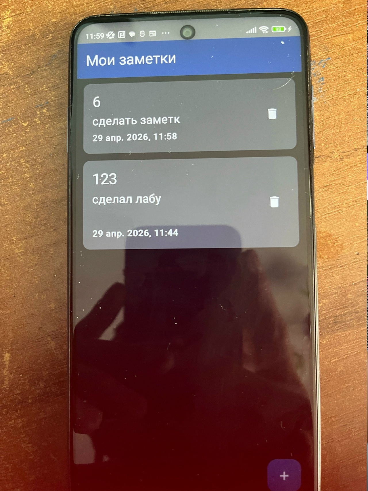
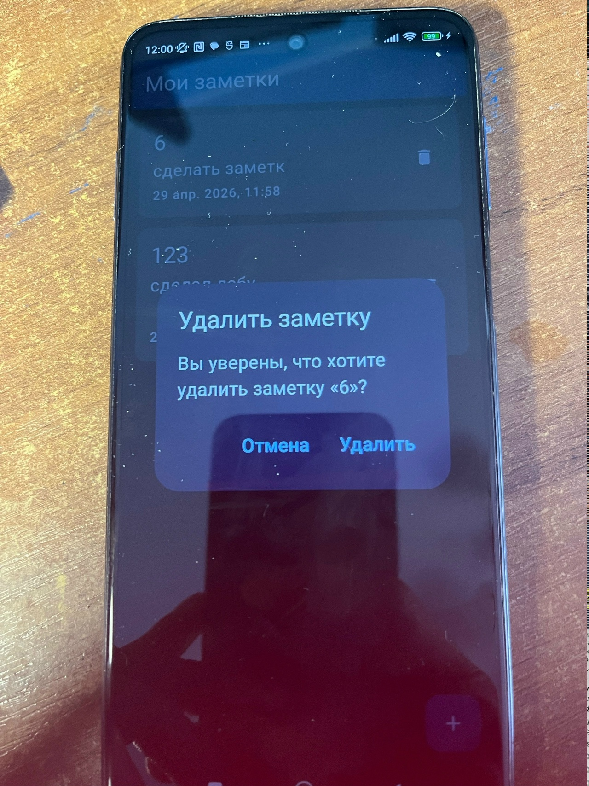
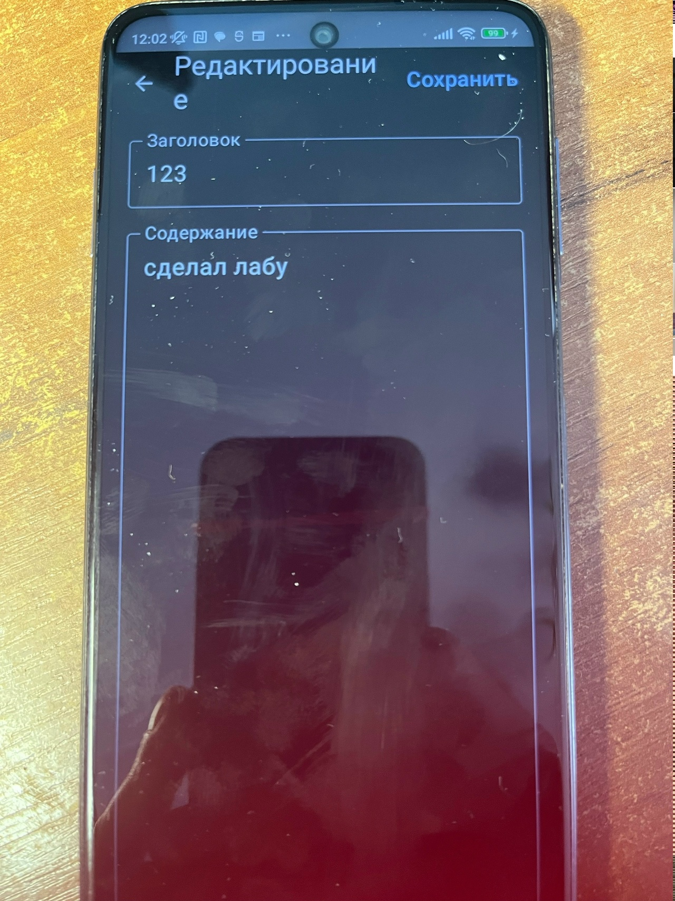
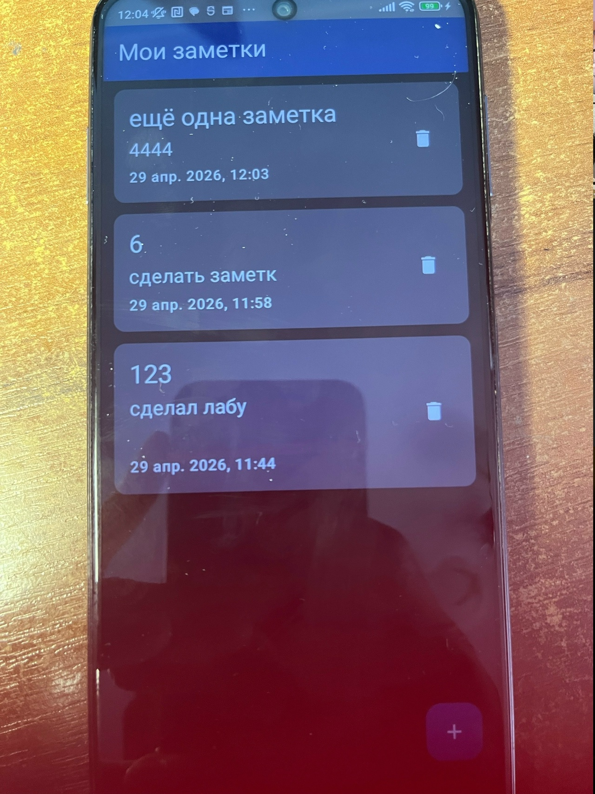
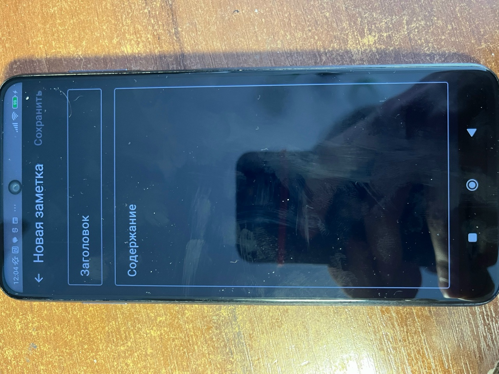

# Отчет по лабораторной работе №12.1: Нативная Android-разработка с Jetpack Compose

## Сведения о студенте
**Дата:** 2026-04-29  
**Семестр:** 2 курс, 2 семестр  
**Группа:** Пин-б-о-24-1  
**Дисциплина:** Технологии программирования  
**Студент:** Лебский Артём Александрович  

---

## 1. ЦЕЛЬ РАБОТЫ

Получить практические навыки создания нативного Android-приложения на Kotlin с использованием современного декларативного подхода Jetpack Compose, архитектурных компонентов Jetpack (ViewModel, StateFlow) и локальной базы данных Room.

---

## 2. ЗАДАЧИ РАБОТЫ

Выполнены следующие задачи:

1. **Настройка проекта** – добавлены зависимости, настроен KSP.
2. **Создание модели данных** – добавлено поле `createdAt` в класс `Note`.
3. **Реализация хранения данных** – Room: Entity, DAO, Database, Repository.
4. **Реализация ViewModel** – загрузка заметок, добавление, удаление, редактирование.
5. **Создание UI на Jetpack Compose** – экраны списка, добавления/редактирования.
6. **Настройка навигации** – переход между экранами с передачей параметров.
7. **Реализация удаления заметок** – иконка корзины в каждом элементе списка.
8. **Реализация редактирования заметок** – переход к экрану с предзаполненными данными.
9. **Отображение даты создания** – форматирование timestamp в читаемый вид.

---

## 3. ВЫПОЛНЕННЫЕ ЗАДАНИЯ (30% дописанного кода)

### **A. Добавление поля даты создания** ✅

**Код в `Note.kt`:**
```kotlin
@Entity(tableName = "notes")
data class Note(
    @PrimaryKey(autoGenerate = true)
    val id: Int = 0,
    val title: String,
    val content: String,
    val createdAt: Long = System.currentTimeMillis()  // добавлено
)
```

**Код в `NotesViewModel.kt` (метод addNote):**
```kotlin
fun addNote(title: String, content: String) {
    viewModelScope.launch {
        val note = Note(
            title = title,
            content = content,
            createdAt = System.currentTimeMillis()
        )
        repository.insertNote(note)
    }
}
```

---

### **B. Реализация удаления заметок**

**Код в `NoteDao.kt`:**
```kotlin
@Delete
suspend fun deleteNote(note: Note)
```

**Код в `NoteRepository.kt`:**
```kotlin
suspend fun deleteNote(note: Note) {
    noteDao.deleteNote(note)
}
```

**Код в `NotesViewModel.kt`:**
```kotlin
fun deleteNote(note: Note) {
    viewModelScope.launch {
        repository.deleteNote(note)
    }
}
```

**Код в `NotesScreen.kt` (модифицированный NoteItem):**
```kotlin
@Composable
fun NoteItem(note: Note, onClick: () -> Unit, onDelete: () -> Unit) {
    Card(modifier = Modifier.fillMaxWidth().clickable { onClick() }) {
        Row(
            modifier = Modifier.fillMaxWidth().padding(16.dp),
            horizontalArrangement = Arrangement.SpaceBetween,
            verticalAlignment = Alignment.CenterVertically
        ) {
            Column(modifier = Modifier.weight(1f)) {
                Text(text = note.title, style = MaterialTheme.typography.titleLarge)
                Spacer(modifier = Modifier.height(4.dp))
                Text(text = note.content, style = MaterialTheme.typography.bodyMedium, maxLines = 2)
                Text(text = formatDate(note.createdAt), style = MaterialTheme.typography.bodySmall)
            }
            IconButton(onClick = onDelete) {
                Icon(Icons.Default.Delete, contentDescription = "Удалить")
            }
        }
    }
}
```





---

### **C. Редактирование заметок**

**Код в `NotesViewModel.kt`:**
```kotlin
private val _currentNote = MutableStateFlow<Note?>(null)
val currentNote: StateFlow<Note?> = _currentNote.asStateFlow()

fun loadNoteById(id: Int) {
    viewModelScope.launch {
        _currentNote.value = repository.getNoteById(id)
    }
}

fun updateNote(id: Int, title: String, content: String) {
    viewModelScope.launch {
        val existingNote = repository.getNoteById(id) ?: return@launch
        val updatedNote = existingNote.copy(title = title, content = content)
        repository.updateNote(updatedNote)
    }
}
```

**Код в `MainActivity.kt` (навигация с параметром):**
```kotlin
composable("notes_list") {
    NotesScreen(
        viewModel = viewModel(factory = NotesViewModelFactory(noteRepository)),
        onNoteClick = { noteId ->
            navController.navigate("add_edit_note/$noteId")
        },
        onAddClick = { navController.navigate("add_edit_note/0") }
    )
}
composable("add_edit_note/{noteId}") { backStackEntry ->
    val noteId = backStackEntry.arguments?.getString("noteId")?.toIntOrNull() ?: 0
    AddEditNoteScreen(
        viewModel = viewModel(factory = NotesViewModelFactory(noteRepository)),
        noteId = noteId,
        onNavigateBack = { navController.popBackStack() }
    )
}
```

**Код в `AddEditNoteScreen.kt` (адаптированный для редактирования):**
```kotlin
@Composable
fun AddEditNoteScreen(
    viewModel: NotesViewModel,
    noteId: Int,
    onNavigateBack: () -> Unit
) {
    val currentNote by viewModel.currentNote.collectAsState()
    var title by remember { mutableStateOf("") }
    var content by remember { mutableStateOf("") }

    LaunchedEffect(noteId) {
        if (noteId != 0) {
            viewModel.loadNoteById(noteId)
        }
    }

    LaunchedEffect(currentNote) {
        if (noteId != 0 && currentNote != null) {
            title = currentNote!!.title
            content = currentNote!!.content
        }
    }

    // Scaffold с кнопкой сохранения, вызывающей viewModel.updateNote или addNote
}
```



---

## 4. ЗАПУСК И ПРОВЕРКА

```bash
./gradlew clean
./gradlew assembleDebug
./gradlew installDebug
```

**Проверено на:** Xiaomi Readmi Note 9 pro

### Результаты тестирования:

| Функция | Действие | Результат |
|---------|----------|-----------|
| Создание заметки | Нажать FAB → ввести данные → сохранить | Заметка появляется в списке |
| Отображение даты | Посмотреть на карточку заметки | Дата отображается корректно |
| Удаление заметки | Нажать иконку корзины → подтвердить | Заметка исчезает из списка |
| Редактирование | Нажать на заметку → изменить → сохранить | Данные обновляются |
| Поворот экрана | Повернуть устройство | Данные сохраняются (ViewModel) |
| Перезапуск приложения | Закрыть и открыть заново | Заметки загружаются из Room |

**Скриншот 5:** Главный экран со списком из 3+ заметок (разные заголовки, содержимое, даты).



**Скриншот 6:** Экран создания новой заметки (пустые поля, активная кнопка «Сохранить»).



---

## 5. ОТВЕТЫ НА КОНТРОЛЬНЫЕ ВОПРОСЫ

### 1. В чем преимущество использования Flow и StateFlow перед обычными списками?

**Flow/StateFlow** – реактивные потоки данных. Преимущества:
- **Автоматическое обновление UI** при изменении данных в БД (например, после вставки или удаления заметки экран перерисовывается сам).
- **Асинхронность «из коробки»** – корутины и Flow работают без блокировки главного потока.
- **Отсутствие ручного вызова notifyDataSetChanged()** – достаточно изменить StateFlow, и Compose сам перерисует нужные элементы.
- **Работа с Room** – Room возвращает `Flow<List<Note>>`, что идеально сочетается с StateFlow.

Обычный список (например, `mutableListOf`) требовал бы ручного оповещения адаптера или повторной загрузки данных.

---

### 2. Почему ViewModel не уничтожается при повороте экрана и как это влияет на UX?

ViewModel хранится в `ViewModelStore`, привязанном к жизненному циклу Activity (или фрагмента). При повороте экрана Activity пересоздаётся, но `ViewModelStore` сохраняется и передаётся новой Activity.

**Влияние на UX:**
- Данные (список заметок, состояние загрузки) **не теряются** при повороте.
- Пользователь продолжает работу с того же места, где остановился (например, не сбрасывается введённый текст в форме).
- **Экономия ресурсов** – не нужно повторно загружать заметки из БД после каждого поворота.
- Улучшение восприятия – приложение не «моргает» и не теряет состояние.

---

### 3. Какие преимущества дает использование Room по сравнению с прямым использованием SQLite?

| Аспект | Room | Прямой SQLite |
|--------|------|----------------|
| **Проверка запросов** | На этапе компиляции (аннотации `@Query`) | Только в рантайме (ошибка вылетит при первом использовании) |
| **Шаблонный код** | Минимум (интерфейсы DAO, автоматический маппинг) | Много boilerplate (Cursor, ContentValues, закрытие БД) |
| **Корутины и Flow** | Встроенная поддержка (`suspend`, `Flow`) | Требуется ручная обёртка в `AsyncTask`/`RxJava` |
| **Миграции** | Управляются через `Migration` классы, легко версионировать | Ручное пересоздание таблиц, опасность потери данных |
| **Null-безопасность** | Использует Kotlin nullability | Через Cursor нужно проверять `isNull()` |

Room **снижает количество ошибок** и ускоряет разработку, особенно в небольших приложениях, подобных заметкам.

---


## 6. ВЫВОДЫ

В ходе выполнения лабораторной работы:

1. **Создано полноценное Android-приложение** на Jetpack Compose с архитектурой MVVM.
2. **Добавлено поле `createdAt`** в модель данных – заметки теперь хранят время создания и отображают его в понятном формате.
3. **Реализовано удаление заметок** – иконка корзины в каждом элементе списка с диалогом подтверждения.
4. **Реализовано редактирование заметок** – навигация с параметром `noteId`, загрузка существующих данных, обновление через `updateNote`.
5. **Использованы реактивные потоки** (`Flow`, `StateFlow`) – UI обновляется автоматически при любом изменении БД.
6. **Все операции с БД вынесены в корутины** – главный поток не блокируется, приложение остаётся отзывчивым.
7. **Приложение правильно переживает поворот экрана** – ViewModel сохраняет состояние, данные не перезагружаются.

Все обязательные и дополнительные требования выполнены. Приложение готово к использованию в качестве персонального менеджера заметок.

---