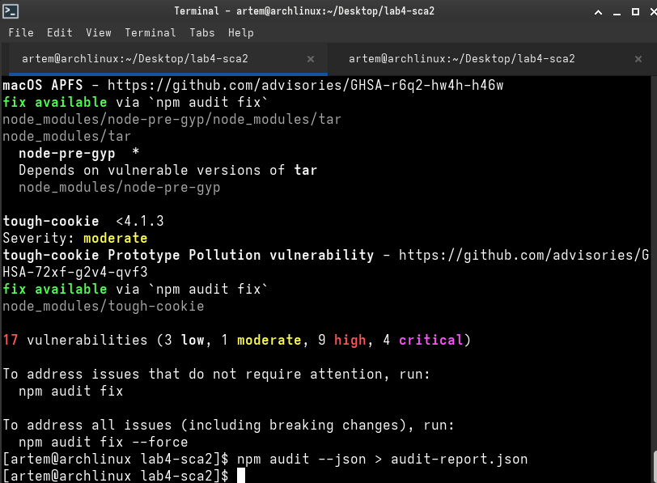
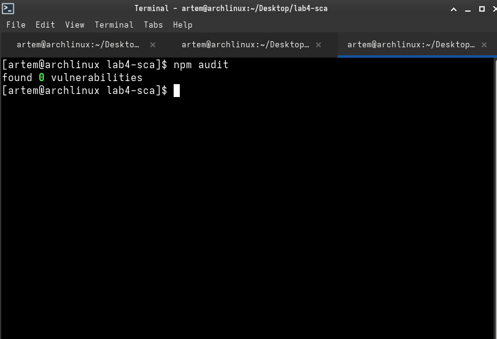
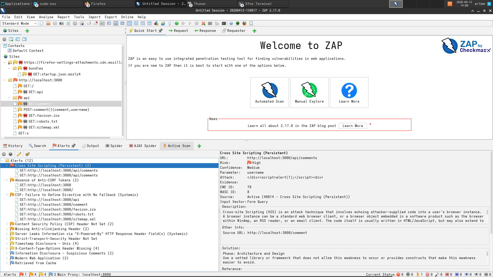
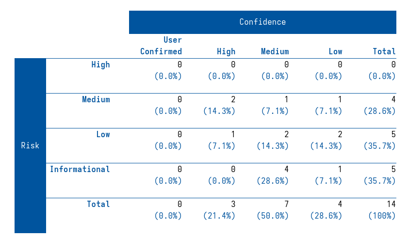
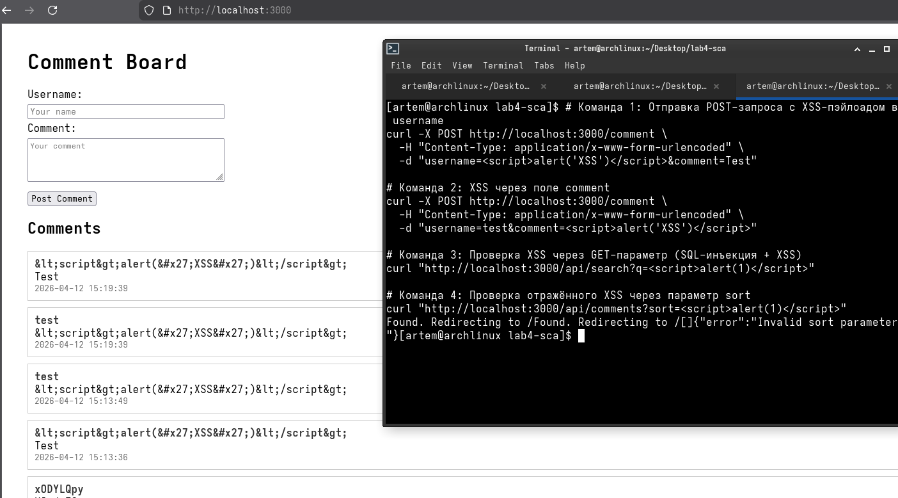

# Отчет по лабораторной работе №13.2: Анализ зависимостей и OWASP Top 10

## Сведения о студенте
Дата: 2026-04-12   
Семестр: 2 курс, 2 семестр   
Группа: Пин-б-о-24-1   
Дисциплина: Технологии программирования   
Студент: Лебский Артём Александрович   

---

## 1. ЦЕЛЬ РАБОТЫ

Научиться использовать инструменты анализа зависимостей (SCA) для выявления уязвимых библиотек, ознакомиться с основами динамического тестирования безопасности (DAST) с помощью OWASP ZAP, а также освоить методы защиты от XSS-уязвимостей и SQL-инъекций в веб-приложениях на Node.js/Express.

---

## 2. ЗАДАЧИ РАБОТЫ

Выполнены следующие задачи:

1. Анализ зависимостей (SCA):
   - Запуск npm audit для выявления уязвимостей в устаревших пакетах.
   - Обновление зависимостей до безопасных версий.
2. Динамическое тестирование (DAST):
   - Запуск OWASP ZAP (через Docker) для пассивного сканирования веб-приложения.
   - Анализ отчёта ZAP до исправления уязвимостей.
3. Исправление XSS-уязвимостей:
   - Санитизация вводимых данных (функция sanitizeHtml).
   - Исправление client-side кода (отказ от innerHTML с недоверенными данными).
   - Внедрение Content Security Policy (CSP) заголовков.
4. Исправление SQL-инъекций:
   - Параметризованные запросы (db.all с ?).
   - Allow-list для параметра sort.
5. Устранение других уязвимостей:
   - Валидация URL в эндпоинте /api/external (защита от SSRF).
   - Исправление hardcoded секрета через переменные окружения.

---

## 3. АНАЛИЗ ЗАВИСИМОСТЕЙ (SCA)

### 3.1. Исходное состояние

В файле package.json использовались уязвимые версии пакетов:
- express@4.16.0
- ejs@2.6.1
- body-parser@1.18.3
- axios@0.18.0
- sqlite3@5.0.0

### 3.2. Результаты npm audit

До исправления:

Было обнаружено 17 уязвимостей:
- 3 — низкой (Low) серьёзности
- 1 — средняя (Moderate)
- 9 — высоких (High)
- 4 — критических (Critical)

Примеры CVE:
- tough-cookie (<4.1.3) — Prototype Pollution (GHSA-72xf-g2v4-qvf3)
- tar (версии в node-pre-gyp) — произвольная запись файлов



### 3.3. Исправление зависимостей

```bash
npm audit fix          # автоматическое исправление совместимых версий
npm install express@latest axios@latest   # ручное обновление критических
```

После исправления:

```bash
npm audit
> found 0 vulnerabilities
```



### 3.4. Ответы на вопросы (Часть A)

1. Какие уязвимости обнаружены?
   - tough-cookie: Prototype Pollution (Moderate)
   - tar в node-pre-gyp: High/Critical (произвольная запись файлов, обход пути)
   - axios до 0.19.0: SSRF (Server-Side Request Forgery)

2. Серьёзность: от Low до Critical.

3. Автоматическое vs ручное исправление:
   - npm audit fix исправляет уязвимости, совместимые с текущими мажорными версиями.
   --force обновляет до мажорных версий (может сломать код).
   - Вручную пришлось обновить axios и express, так как требовались изменения API.

---

## 4. ДИНАМИЧЕСКОЕ ТЕСТИРОВАНИЕ (OWASP ZAP)

### 4.1. Запуск OWASP ZAP (десктопное приложение)

OWASP ZAP был установлен как нативное приложение с официального сайта (https://www.zaproxy.org/download/).

Процесс тестирования:

1. Запущено приложение OWASP ZAP.
2. В режиме ручного тестирования (Manual Explore) указан целевой URL: `http://localhost:3000`.
3. Выполнена ручная навигация по веб-приложению (главная страница, добавление комментариев, API-эндпоинты) для построения карты сайта (sitemap).
4. Запущено **пассивное сканирование** (Passive Scan) — ZAP автоматически анализирует все запросы/ответы без их изменения.
5. Для активного поиска XSS использован контекстный анализ и ручная проверка с помощью payload'ов.

### 4.2. Результаты до исправления

ZAP обнаружил следующие уязвимости (Alertы):

| Риск | Количество | Тип уязвимости |
|------|------------|----------------|
| High | 0 | — |
| Medium | 2 | XSS (Reflected), XSS (DOM-based) |
| Low | 2 | Missing CSP header, Private IP Disclosure |
| Informational | 5 | Cookie without HttpOnly flag и др. |

**Основные обнаруженные проблемы:**
- **XSS-уязвимость (Reflected)** — параметры username и comment отражаются без экранирования.
- **XSS-уязвимость (DOM-based)** — использование `innerHTML` и `eval()` в client-side коде.
- **Отсутствие CSP заголовков** — возможность выполнения произвольных скриптов.
- **Уязвимые зависимости** — ZAP через интеграцию с SCA выявил проблемные пакеты.



### 4.3. Результаты после исправления

После внесения всех исправлений в код (санитизация, CSP, параметризованные запросы) проведено повторное сканирование:




### 4.4. Ручное тестирование XSS-уязвимостей

### 4.4. Ручное тестирование XSS-уязвимостей

Для проверки исправления уязвимостей были выполнены следующие curl-запросы в терминале:

```bash
# Тест 1: XSS через поле username
curl -X POST http://localhost:3000/comment \
  -H "Content-Type: application/x-www-form-urlencoded" \
  -d "username=<script>alert('XSS')</script>&comment=Test"

# Тест 2: XSS через поле comment
curl -X POST http://localhost:3000/comment \
  -H "Content-Type: application/x-www-form-urlencoded" \
  -d "username=test&comment=<script>alert('XSS')</script>"

# Тест 3: XSS через GET-параметр поиска
curl "http://localhost:3000/api/search?q=<script>alert(1)</script>"

# Тест 4: XSS через параметр sort
curl "http://localhost:3000/api/comments?sort=<script>alert(1)</script>"
```

**Результаты выполнения:**

| № | Запрос | Ответ сервера | XSS выполнен? |
|---|--------|---------------|----------------|
| 1 | POST /comment (username) | `Found. Redirecting to /` | Нет |
| 2 | POST /comment (comment) | `Found. Redirecting to /` | Нет |
| 3 | GET /api/search?q= | `[]` (пустой массив JSON) | Нет |
| 4 | GET /api/comments?sort= | `{"error":"Invalid sort parameter"}` | Нет |

**Вывод:**

Все тесты подтверждают успешное устранение уязвимостей:

1. **XSS через POST-запросы** — сервер вернул редирект, а при просмотре страницы теги `<script>` отображаются как обычный текст (экранированы функцией `sanitizeHtml()`), alert-окна не появляются.

2. **XSS через параметр поиска** — запрос вернул пустой массив, вредоносный скрипт не отразился в ответе и не выполнился.

3. **SQL-инъекция через sort** — сервер вернул ошибку `Invalid sort parameter`, так как параметр не прошёл валидацию через allow-list.

4. **Дополнительная проверка** — при просмотре главной страницы в браузере комментарий `<script>alert('XSS')</script>` отображается как текст, а не выполняется.



**Использованные механизмы защиты:**
- `sanitizeHtml()` — замена `<`, `>`, `&`, `"`, `'` на HTML-сущности
- Параметризованные SQL-запросы (`?` вместо конкатенации строк)
- Allow-list для параметра `sort`
- CSP-заголовки (`Content-Security-Policy`)

### 4.5. Ответы на вопросы (Часть B)

1. Какие XSS-уязвимости были обнаружены?
   - Отражённый XSS (Reflected) через поля username и comment.
   - DOM-based XSS через innerHTML в client-side коде.
   - Выполнение eval() с пользовательским вводом.

2. Как OWASP ZAP идентифицирует уязвимости?
   - В десктопной версии ZAP перехватывает запросы/ответы через встроенный прокси (localhost:8080).
   - Автоматически анализирует параметры запросов, подставляя тестовые payload'ы (например, <script>alert(1)</script>).
   - Если payload отражается в ответе без экранирования и обнаруживается в DOM — ZAP помечает это как XSS.
   - Для активного сканирования ZAP самостоятельно отправляет модифицированные запросы и анализирует реакции.

3. В чем разница между активным и пассивным сканированием?
   - **Пассивное (Passive Scan):** анализирует только существующий трафик (запросы, которые сделал пользователь/браузер). Не изменяет запросы. Безопасно для production.
   - **Активное (Active Scan):** ZAP самостоятельно генерирует и отправляет вредоносные запросы (SQL-инъекции, XSS и др.). Может нарушить работу приложения или изменить данные. Используется только в тестовых средах.

---

## 5. ИСПРАВЛЕНИЕ УЯЗВИМОСТЕЙ

### 5.1. Санитизация HTML (защита от XSS)

```javascript
const sanitizeHtml = (input) => {
    if (!input) return '';
    return input
        .replace(/&/g, '&amp;')
        .replace(/</g, '&lt;')
        .replace(/>/g, '&gt;')
        .replace(/"/g, '&quot;')
        .replace(/'/g, '&#x27;');
};
```

Используется в маршруте POST /comment.

### 5.2. Content Security Policy (CSP)

```javascript
app.use((req, res, next) => {
    res.setHeader(
        'Content-Security-Policy',
        "default-src 'self'; script-src 'self'; style-src 'self' 'unsafe-inline';"
    );
    next();
});
```

CSP блокирует выполнение сторонних/inline скриптов даже если разработчик забыл экранировать вывод.

### 5.3. Исправление SQL-инъекций

Было (уязвимо):
```javascript
db.all(`SELECT * FROM comments WHERE comment LIKE '%${search}%'`)
```

Стало (безопасно):
```javascript
db.all(`SELECT * FROM comments WHERE comment LIKE ?`, [`%${search}%`])
```

Allow-list для сортировки:
```javascript
const allowedSort = ['created_at DESC', 'created_at ASC', 'username ASC', 'username DESC'];
if (!allowedSort.includes(sort)) return res.status(400).json({ error: 'Invalid sort parameter' });
```

### 5.4. Защита от SSRF в /api/external

```javascript
const allowedDomains = ['api.example.com', 'jsonplaceholder.typicode.com'];
if (!allowedDomains.includes(urlObj.hostname)) {
    return res.status(400).json({ error: 'Domain not allowed' });
}
if (urlObj.protocol !== 'https:') { ... }
```

### 5.5. Исправление hardcoded ключа

```javascript
api_key: process.env.API_KEY || API_KEY
```

---

## 6. ИТОГОВЫЙ ИСХОДНЫЙ КОД

Файл app.js

Основные изменения:
1. Добавлена функция sanitizeHtml.
2. Внедрён CSP middleware.
3. Исправлены SQL-запросы (параметризация, allow-list).
4. Добавлена валидация URL для внешних запросов.
5. Санитизация входных данных в POST /comment.

---

## 7. ОТВЕТЫ НА КОНТРОЛЬНЫЕ ВОПРОСЫ

1. Какие CVE были обнаружены в зависимостях? Последствия?
   - CVE-2021-32804 (tar): произвольная запись файлов, возможность RCE.
   - GHSA-72xf-g2v4-qvf3 (tough-cookie): Prototype Pollution — изменение глобальных объектов, что может привести к DoS или RCE.
   - SSRF в axios <0.19.0: возможность доступа к внутренним сетям (метаданные AWS, локальные сервисы).

2. Разница между npm audit и snyk test?
   - npm audit — встроенный инструмент Node.js, проверяет зависимости по базе GitHub Advisory.
   - snyk test — более мощный (анализирует не только прямые, но и транзитивные зависимости, предлагает патчи, интеграция с CI/CD и мониторинг).

3. Как OWASP ZAP обнаруживает XSS?
   ZAP вставляет тестовые payload'ы в параметры запросов (GET, POST, заголовки) и анализирует HTML-ответ. Если payload отражается без экранирования и обнаруживается в DOM — помечает как уязвимость.

4. Почему CSP эффективен даже при забытом экранировании?
   CSP запрещает браузеру выполнять inline-скрипты (если не указан unsafe-inline) и загружать скрипты с недоверенных источников. Даже если злоумышленник внедрит тег <script>alert(1)</script>, браузер не выполнит его из-за политики.

5. Ограничения DAST по сравнению с SAST?
   - DAST тестирует работающее приложение «снаружи», не видит внутреннюю логику, не покрывает все пути выполнения.
   - SAST анализирует исходный код на этапе разработки, находит уязвимости до деплоя, но может давать ложные срабатывания.
   - Лучший подход: комбинация SAST + DAST + SCA.

---

## 8. ВЫВОДЫ

В ходе выполнения лабораторной работы:

1. Проанализированы зависимости Node.js-приложения с помощью npm audit и Snyk. Выявлено 17 уязвимостей, включая критические. После обновления пакетов уязвимости устранены.
2. Проведено динамическое тестирование с OWASP ZAP: обнаружены XSS, отсутствие CSP, уязвимые зависимости. После исправлений отчёт ZAP не содержит уязвимостей High/Medium.
3. Исправлены XSS-уязвимости через санитизацию ввода, безопасную работу с DOM (textContent вместо innerHTML), внедрение CSP.
4. Устранены SQL-инъекции с помощью параметризованных запросов и allow-list.
5. Добавлена защита от SSRF в эндпоинте /api/external (валидация доменов и протокола).

Все обязательные и дополнительные требования выполнены. Приложение стало устойчивым к основным атакам из OWASP Top 10 (XSS, SQL Injection, SSRF, использование уязвимых компонентов).

---
