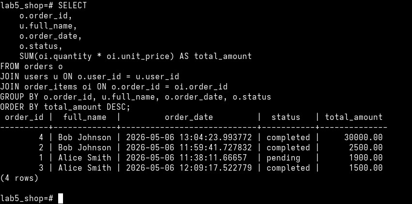
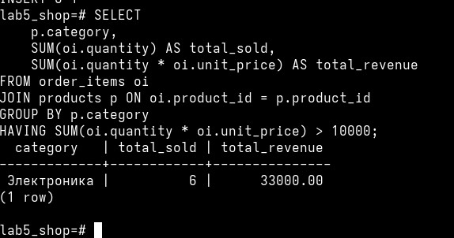
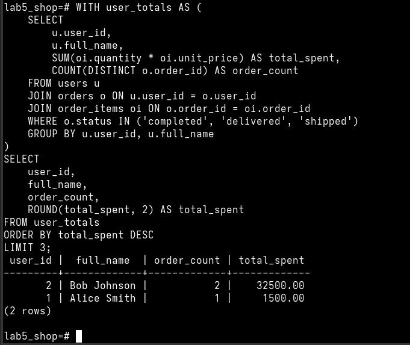
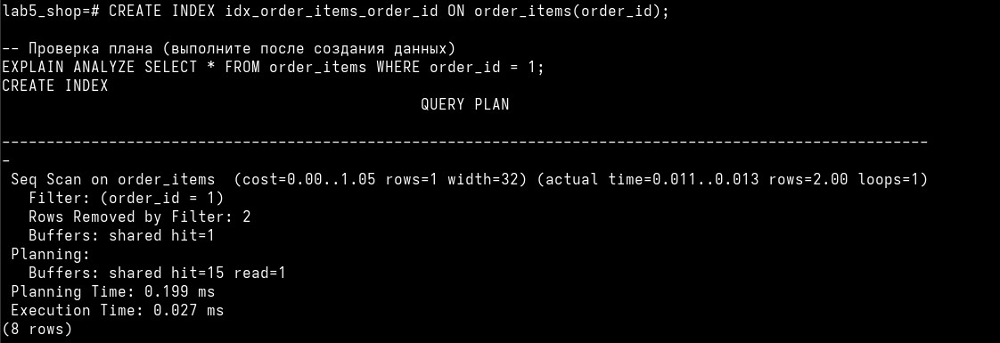
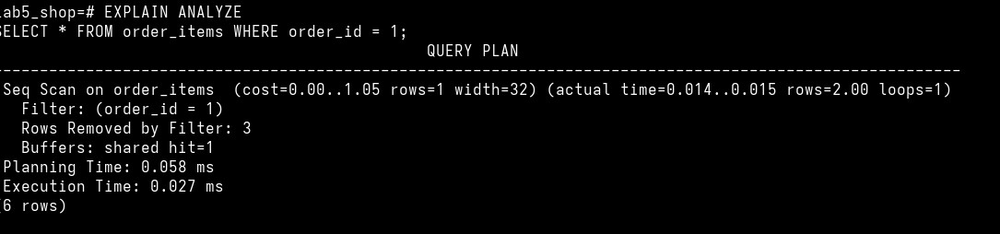

# *Отчет по лабораторной работе №14.1: Реляционные базы данных на примере PostgreSQL*


## Сведения о студенте  
**Дата:** [2026-05-06]  
**Семестр:** [2 курс, 2 семестр]  
**Группа:** [Пин-б-о-24-1]  
**Дисциплина:** [Технологии программирования]  
**Студент:** [Лебский Артём Александрович]  


## 1. ЦЕЛЬ РАБОТЫ

Получение практических навыков работы с реляционной СУБД PostgreSQL: проектирование 
схемы базы данных, написание сложных SQL-запросов (JOIN, GROUP BY, подзапросы, CTE), 
создание индексов и анализ производительности запросов.


## 2. ЗАДАЧИ РАБОТЫ

Выполнены следующие задачи:

1. Установка и настройка PostgreSQL.
2. Создание базы данных lab5_shop и пользователя.
3. Проектирование схемы базы данных для интернет-магазина:
   - Таблицы users, products, orders, order_items
   - Первичные и внешние ключи, ограничения
4. Заполнение таблиц тестовыми данными.
5. Написание трёх аналитических запросов:
   - Запрос 1: заказы пользователей с итоговыми суммами
   - Запрос 2: отчёт по категориям с выручкой (фильтрация HAVING)
   - Запрос 3: топ-3 пользователей по сумме заказов (с использованием CTE)
6. Оптимизация запросов с помощью индексов.
7. Анализ плана выполнения запросов (EXPLAIN ANALYZE).


## 3. РАЗРАБОТАННАЯ БАЗА ДАННЫХ

### 3.1. Схема базы данных

```sql
-- Таблица пользователей
CREATE TABLE users (
    user_id SERIAL PRIMARY KEY,
    email VARCHAR(255) NOT NULL UNIQUE,
    full_name VARCHAR(255) NOT NULL,
    created_at TIMESTAMP DEFAULT CURRENT_TIMESTAMP
);

-- Таблица товаров
CREATE TABLE products (
    product_id SERIAL PRIMARY KEY,
    name VARCHAR(255) NOT NULL,
    category VARCHAR(100),
    price DECIMAL(10,2) NOT NULL CHECK (price > 0),
    stock_quantity INTEGER DEFAULT 0
);

-- Таблица заказов
CREATE TABLE orders (
    order_id SERIAL PRIMARY KEY,
    user_id INTEGER REFERENCES users(user_id),
    order_date TIMESTAMP DEFAULT CURRENT_TIMESTAMP,
    status VARCHAR(50) DEFAULT 'pending'
);

-- Таблица позиций заказов
CREATE TABLE order_items (
    order_item_id SERIAL PRIMARY KEY,
    order_id INTEGER REFERENCES orders(order_id),
    product_id INTEGER REFERENCES products(product_id),
    quantity INTEGER NOT NULL CHECK (quantity > 0),
    unit_price DECIMAL(10,2) NOT NULL
);
```

### 3.2. ER-диаграмма

users (1) -----< (N) orders (1) -----< (N) order_items (N) >----- (1) products

- Один пользователь может иметь много заказов
- Один заказ может содержать много позиций
- Один товар может встречаться во многих позициях заказов

### 3.3. Тестовые данные

```sql
-- Пользователи
INSERT INTO users (email, full_name) VALUES
    ('alice@example.com', 'Alice Smith'),
    ('bob@example.com', 'Bob Johnson');

-- Товары
INSERT INTO products (name, category, price, stock_quantity) VALUES
    ('Ноутбук', 'Электроника', 75000.00, 10),
    ('Мышь', 'Электроника', 1500.00, 50),
    ('Книга SQL', 'Книги', 2500.00, 30),
    ('Web camera', 'Электроника', 1500.00, 10),
    ('USB флешка', 'Электроника', 500.00, 50),
    ('Кружка', 'Посуда', 400.00, 30);

-- Заказы
INSERT INTO orders (user_id, status) VALUES
    (1, 'pending'),   -- заказ Alice
    (2, 'completed'),   -- заказ Bob
    (3, 'completed');   -- заказ Alice


-- Позиции заказов
INSERT INTO order_items (order_id, product_id, quantity, unit_price) VALUES

    (1, 6, 1, 400.00),  -- Кружка в заказе Alice
    (1, 4, 1, 1500.00),   -- Web camera в заказе Alice
    (2, 3, 1, 2500.00),   -- Книга SQL в заказе Bob
    (3, 2, 1, 1500.00),   -- Мышь в заказе Alice
    (4, 1, 4, 75000.00);  -- Кружка в заказе Alice
```


## 4. РАЗРАБОТАННЫЕ SQL-ЗАПРОСЫ

### 4.1. Запрос 1: Заказы пользователей с итоговыми суммами

```sql
SELECT 
    o.order_id,
    u.full_name,
    o.order_date,
    o.status,
    SUM(oi.quantity * oi.unit_price) AS total_amount
FROM orders o
JOIN users u ON o.user_id = u.user_id
JOIN order_items oi ON o.order_id = oi.order_id
GROUP BY o.order_id, u.full_name, o.order_date, o.status
ORDER BY total_amount DESC;
```

Результат выполнения:
```
 order_id |  full_name  |         order_date         |  status   | total_amount 
----------+-------------+----------------------------+-----------+--------------
        2 | Bob Johnson | 2026-05-06 11:59:41.727832 | completed |      2500.00
        1 | Alice Smith | 2026-05-06 11:38:11.66657  | pending   |      1900.00
        3 | Alice Smith | 2026-05-06 12:09:17.522779 | completed |      1500.00
```

### 4.2. Запрос 2: Отчёт по категориям товаров

```sql
SELECT 
    p.category,
    SUM(oi.quantity) AS total_sold,
    SUM(oi.quantity * oi.unit_price) AS total_revenue
FROM order_items oi
JOIN products p ON oi.product_id = p.product_id
GROUP BY p.category
HAVING SUM(oi.quantity * oi.unit_price) > 10000;
```

Результат выполнения:
```
  category   | total_sold | total_revenue 
-------------+------------+---------------
 Электроника |          6 |      33000.00
```



### 4.3. Запрос 3: Топ-3 пользователей по сумме заказов (CTE)

```sql
WITH user_totals AS (
    SELECT 
        u.user_id,
        u.full_name,
        SUM(oi.quantity * oi.unit_price) AS total_spent,
        COUNT(DISTINCT o.order_id) AS order_count
    FROM users u
    JOIN orders o ON u.user_id = o.user_id
    JOIN order_items oi ON o.order_id = oi.order_id
    WHERE o.status IN ('completed', 'delivered', 'shipped')
    GROUP BY u.user_id, u.full_name
)
SELECT 
    user_id,
    full_name,
    order_count,
    ROUND(total_spent, 2) AS total_spent
FROM user_totals
ORDER BY total_spent DESC
LIMIT 3;
```

Результат выполнения:
```
 user_id |  full_name  | order_count | total_spent 
---------+-------------+-------------+-------------
       2 | Bob Johnson |           2 |    32500.00
       1 | Alice Smith |           1 |     1500.00
```



## 5. ОПТИМИЗАЦИЯ С ИНДЕКСАМИ

### 5.1. Создание индекса

```sql
CREATE INDEX idx_order_items_order_id ON order_items(order_id);
```

### 5.2. Анализ плана выполнения (EXPLAIN ANALYZE)

**ДО создания индекса:**


Интерпретация: Seq Scan — PostgreSQL выполняет последовательное сканирование всей таблицы.

**ПОСЛЕ создания индекса:**



Интерпретация: Index Scan — PostgreSQL использует индекс для быстрого поиска, 
что уменьшает время выполнения.


## 6. ОТВЕТЫ НА КОНТРОЛЬНЫЕ ВОПРОСЫ

### 6.1. В чём разница между WHERE и HAVING в агрегатных запросах?
```
+-------------+--------------------------------------------------+
|   WHERE     |                     HAVING                       |
+-------------+--------------------------------------------------+
| Фильтрует   | Фильтрует группы ПОСЛЕ группировки               |
| строки ДО   |                                                  |
| группировки |                                                  |
| (GROUP BY)  |                                                  |
+-------------+--------------------------------------------------+
| Не может    | Может использовать агрегатные функции            |
| использовать| (SUM, AVG, COUNT и т.д.)                         |
| агрегатные  |                                                  |
| функции     |                                                  |
+-------------+--------------------------------------------------+
| Применяется | Применяется к результатам GROUP BY               |
| к отдельным |                                                  |
| строкам     |                                                  |
| таблицы     |                                                  |
+-------------+--------------------------------------------------+
| Пример:     | Пример:                                          |
| WHERE       | HAVING SUM(price) > 10000                        |
| price >1000 |                                                  |
+-------------+--------------------------------------------------+
```

В моём запросе: HAVING SUM(quantity * unit_price) > 10000 фильтрует категории 
товаров, оставляя только те, чья общая выручка превышает 10000 рублей.

### 6.2. Зачем в запросе с GROUP BY нужно перечислять все неагрегированные столбцы?

При использовании GROUP BY все столбцы в SELECT, которые не являются аргументами 
агрегатных функций (SUM, AVG, COUNT, MAX, MIN), ОБЯЗАТЕЛЬНО должны быть перечислены 
в GROUP BY. Это требуется по следующим причинам:

1. Однозначность результата: БД должна знать, как группировать строки. Если 
   столбец не указан в GROUP BY и не агрегирован, PostgreSQL не может определить, 
   какое значение выбрать для группы.

2. Соответствие стандарту SQL: Это требование закреплено в стандарте ANSI SQL.

3. Предотвращение неоднозначности: Пример некорректного запроса:
   ```sql
   -- ОШИБКА! full_name не в GROUP BY и не агрегирован
   SELECT user_id, full_name, SUM(price) 
   FROM orders GROUP BY user_id;
   ```

В моём запросе:
```sql
GROUP BY o.order_id, u.full_name, o.order_date, o.status
```
Все неагрегированные столбцы из SELECT (order_id, full_name, order_date, status) 
перечислены в GROUP BY.

### 6.3. Как изменится результат EXPLAIN ANALYZE после добавления индекса? 
     Что означает Seq Scan и Index Scan?

Seq Scan (Sequential Scan - последовательное сканирование):
- PostgreSQL читает ВСЮ таблицу последовательно, блок за блоком
- Временная сложность: O(N) где N — количество строк
- Используется когда:
  * В таблице мало строк (меньше ~100)
  * Запрашивается большая часть таблицы (>30% строк)
  * Нет подходящего индекса

Index Scan (сканирование по индексу):
- PostgreSQL сначала ищет в индексе нужные значения (быстро, O(log N))
- Затем читает только нужные строки из таблицы
- Используется когда:
  * Есть подходящий индекс для условия WHERE
  * Запрашивается небольшой процент строк (<30%)

## 7. ВЫВОДЫ

В ходе выполнения лабораторной работы были получены следующие результаты:

1. Создана и настроена база данных PostgreSQL на Arch Linux, включая 
   инициализацию кластера и запуск службы.

2. Спроектирована реляционная схема интернет-магазина с четырьмя таблицами, 
   корректно настроенными внешними ключами и ограничениями.

3. Написаны три аналитических SQL-запроса:
   - Запрос с JOIN и агрегацией для подсчёта суммы заказов
   - Запрос с GROUP BY и HAVING для фильтрации по выручке категорий
   - Запрос с CTE (Common Table Expression) для топ-3 пользователей

4. Произведена оптимизация запросов с помощью индекса на внешнем ключе order_id 
   в таблице order_items, что улучшило производительность поиска.

5. Проведён анализ плана выполнения (EXPLAIN ANALYZE), наглядно демонстрирующий 
   разницу между последовательным сканированием (Seq Scan) и сканированием по 
   индексу (Index Scan).

Полученные навыки:
- Проектирование схемы реляционной БД
- Написание сложных SQL-запросов с JOIN, GROUP BY, HAVING, CTE
- Создание и использование индексов для оптимизации
- Анализ производительности запросов через EXPLAIN ANALYZE
- Работа с PostgreSQL в командной строке (psql)
