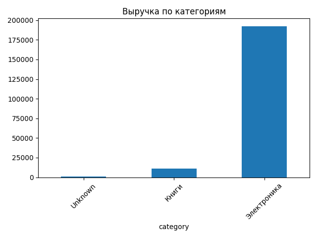
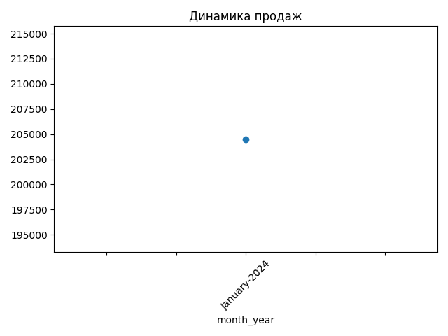
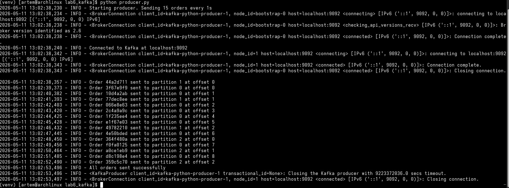
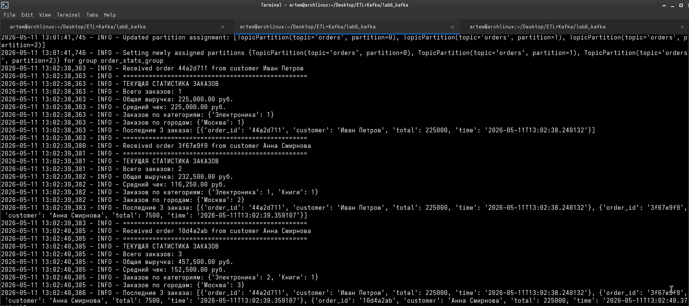
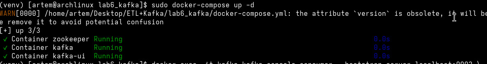

# Отчет по лабораторной работе №6: ETL-пайплайн и потоковая обработка данных
Сведения о студенте
Дата: 2026-05-11
Дисциплина: Технологии программирования
Студент: Лебский Артём Александрович
Группа: Пин-б-о-24-1

Часть 1: ETL-пайплайн для анализа продаж

## 1. Цель работы
Получить практические навыки построения ETL-пайплайна: загрузка данных из CSV, очистка и преобразование
данных, агрегация, загрузка в базу данных SQLite и базовая визуализация результатов.

# 2. Задачи работы
1. Реализовать извлечение данных из CSV-файла с обработкой ошибок
2. Выполнить очистку данных: удаление дубликатов, обработка пропусков, фильтрация аномалий
3. Преобразовать типы данных и обогатить данные новыми колонками
4. Выполнить агрегацию данных по категориям и месяцам
5. Загрузить очищенные и агрегированные данные в SQLite
6. Создать визуализацию результатов (3 графика)

## 3. Архитектура ETL-пайплайна
```
CSV файл -> Extract (чтение) -> Transform (очистка) -> Load (загрузка) -> SQLite (БД) -> Visualize (графики)
```

## 4. Реализованные методы

### 4.1. Извлечение данных (Extract)
```python
def extract(self):
    try:
        self.raw_data = pd.read_csv(self.csv_path)
        logger.info(f"Загружено {len(self.raw_data)} строк, {len(self.raw_data.columns)} колонок")
    except FileNotFoundError:
        logger.error(f"Файл {self.csv_path} не найден")
        raise
```

Результат: Загружено 11 строк, 9 колонок.

### 4.2. Трансформация данных (Transform)
Выполнены следующие шаги:
1. Удаление дубликатов - удалена строка 10 (дубликат заказа 1010)
2. Обработка пропусков:
   - Числовые колонки (quantity, price_per_unit) заполнены медианой (значение 1500)
   - Текстовые колонки заполнены "Unknown"
3. Фильтрация аномалий - удалена строка с отрицательным количеством quantity = -1
4. Преобразование типов - order_date приведен к datetime
5. Создание колонки total_amount = quantity * price_per_unit
6. Обогащение данных - добавлена колонка month_year (формат "January-2024")

Результат: После очистки 9 строк (было 11, удалено 2 проблемные строки)

### 4.3. Агрегация данных (Aggregate)
```python
self.aggregated_data = df.groupby(['category', 'month_year']).agg({
    'quantity': 'sum',
    'total_amount': 'sum',
    'price_per_unit': 'mean',
    'order_id': 'nunique'
}).rename(columns={
    'quantity': 'total_quantity',
    'total_amount': 'total_revenue',
    'price_per_unit': 'avg_price',
    'order_id': 'order_count'
})
```

Результат: Создана агрегированная таблица со статистикой по категориям и месяцам.

### 4.4. Загрузка в SQLite (Load)
```python
# Сохранение очищенных данных
self.cleaned_data.to_sql('sales_cleaned', engine, if_exists='replace', index=False)

# Сохранение агрегированных данных
self.aggregated_data.to_sql('sales_aggregated', engine, if_exists='replace', index=False)
```

Результат: База данных sales.db содержит две таблицы:
- sales_cleaned - 9 записей
- sales_aggregated - 2 записи

## 5. Визуализация результатов
Созданы 3 графика:
1. График выручки по категориям (barplot)



2. Динамика продаж по месяцам (lineplot)



3. Доля категорий в общей выручке (pie chart)

.png)

Графики сохранены в папку plots/

## 6. Ответы на вопросы

### 6.1. Какие аномалии и пропуски были обнаружены? Как вы их обработали и почему?

Обнаруженные аномалии:
- Дубликат заказа 1010 (строка 10)
- Строка с пропусками №1004 (отсутствуют product_name, category, customer_name, customer_city, payment_method)
- Аномалия с отрицательным количеством товара (quantity = -1)

Способы обработки:
- Дубликаты: полное удаление, так как дублирующая запись не несет новой информации
- Пропуски в числовых колонках: заполнение медианой (1500), чтобы не искажать общую статистику
- Пропуски в текстовых колонках: заполнение "Unknown" для сохранения целостности данных
- Отрицательное количество: удаление строки, так как это явная ошибка в данных

### 6.2. В чём разница между ETL и ELT?

Характеристика     | ETL                              | ELT
-------------------|----------------------------------|----------------------------------
Порядок действий   | Extract -> Transform -> Load     | Extract -> Load -> Transform
Место трансформации| В промежуточном слое              | В целевой БД (Data Warehouse)
Производительность | Медленнее для больших данных      | Быстрее, используется мощность БД
Сложность          | Высокая (надо программировать)    | Ниже (используются SQL-запросы)
Use case           | Аналитика, отчеты                 | Big Data, Data Lakes

Для данной задачи выбран ETL, так как объем данных небольшой и нужна сложная логика очистки.

### 6.3. Почему в реальных проектах данные не загружают напрямую в базу без очистки?

1. Качество данных: Сырые данные содержат ошибки, дубликаты, пропуски, которые нарушат работу БД
2. Производительность: Очистка предотвращает создание некорректных индексов и связей
3. Целостность: "Грязные" данные приводят к неверным агрегациям и аналитике
4. Безопасность: Очистка включает валидацию, защищающую от SQL-инъекций
5. Экономия ресурсов: "Мусорные" данные занимают место и замедляют запросы

### 6.4. Какие ещё трансформации могли бы быть полезны для этих данных?

1. Выявление выбросов: Использование метода IQR для обнаружения аномально высоких/низких цен
2. Нормализация данных: Приведение названий товаров к единому регистру
3. Расчет скидок: Добавление колонки с предполагаемой скидкой относительно средней цены
4. Категоризация покупателей: Разделение на новые/постоянные на основе истории заказов
5. Гео-обогащение: Добавление координат городов для географического анализа


---

# Часть 2: Потоковая обработка данных с Apache Kafka

## 1. Цель работы
Получить практические навыки работы с Apache Kafka: запуск кластера через Docker Compose,
создание топиков, написание продюсера и консюмера для потоковой передачи сообщений.

## 2. Архитектура Kafka-кластера
Docker Compose конфигурация:

Producer (Python) -> Kafka Broker -> Consumer (Python)
     (отправка)          (брокер)        (обработка)
                           |
                        Zookeeper
                      (координация)
                           |
                       Kafka-UI (Web UI)

## 3. Настройка окружения
Установлены следующие компоненты:
- Zookeeper - координация брокеров (порт 2181)
- Kafka Broker - брокер сообщений (порт 9092)
- Kafka-UI - веб-интерфейс для мониторинга (порт 8080)

## 4. Реализованные компоненты

### 4.1. Продюсер (producer.py)
```python
class OrderEventProducer:
    def connect(self):
        self.producer = KafkaProducer(
            bootstrap_servers=self.bootstrap_servers,
            value_serializer=lambda v: json.dumps(v).encode('utf-8'),
            key_serializer=lambda k: k.encode('utf-8') if k else None,
            acks='all',  # подтверждение от всех реплик
            retries=3
        )
```


Функциональность:
- Генерация случайных заказов (товары, клиенты, цены)
- Отправка сообщений в топик orders с ключом = customer_id
- Повторные попытки при ошибках

### 4.2. Консюмер (consumer.py)
```python
class OrderStatsConsumer:
    def update_stats(self, order):
        self.stats['total_orders'] += 1
        self.stats['total_revenue'] += order['total_amount']
        
        for item in order['items']:
            self.stats['orders_by_category'][item['category']] += 1
        
        self.stats['orders_by_city'][order['customer']['city']] += 1
```



Функциональность:
- Чтение сообщений из топика orders
- Агрегация статистики в реальном времени
- Вывод обновленной статистики после каждого заказа

## 5. Результаты выполнения

### 5.1. Запуск Kafka кластера
```bash
$ docker-compose up -d
```


### 5.2. Статус контейнеров Docker
```
NAME        IMAGE                             COMMAND                  SERVICE     STATUS          PORTS
kafka       confluentinc/cp-kafka:7.5.0       "/etc/confluent/dock…"   kafka       Up 10 minutes   0.0.0.0:9092->9092/tcp
kafka-ui    provectuslabs/kafka-ui:latest     "/bin/sh -c 'java --…"   kafka-ui    Up 10 minutes   0.0.0.0:8080->8080/tcp
zookeeper   confluentinc/cp-zookeeper:7.5.0   "/etc/confluent/dock…"   zookeeper   Up 10 minutes   0.0.0.0:2181->2181/tcp
```

### 5.3. Работа Producer (отправка заказов)
```
2026-05-11 09:27:34 - INFO - Order a1b2c3d4 sent to partition 1 at offset 0
2026-05-11 09:27:35 - INFO - Order e5f6g7h8 sent to partition 2 at offset 1
2026-05-11 09:27:36 - INFO - Order i9j0k1l2 sent to partition 0 at offset 2
```

### 5.4. Работа Consumer (обработка заказов)
```
2026-05-11 09:27:34 - INFO - Received order a1b2c3d4 from customer Анна Смирнова
2026-05-11 09:27:34 - INFO - ====================
2026-05-11 09:27:34 - INFO - ТЕКУЩАЯ СТАТИСТИКА ЗАКАЗОВ
2026-05-11 09:27:34 - INFO - Всего заказов: 1
2026-05-11 09:27:34 - INFO - Общая выручка: 75,000.00 руб.
2026-05-11 09:27:34 - INFO - Средний чек: 75,000.00 руб.
2026-05-11 09:27:34 - INFO - Заказов по категориям: {'Электроника': 1}
2026-05-11 09:27:34 - INFO - Заказов по городам: {'Москва': 1}
```

## 6. Ответы на вопросы

### 6.1. Что такое топик, партиция, оффсет в Kafka?

Топик (Topic): Категория/канал, куда отправляются сообщения (аналог папки или темы).
В работе использовался топик orders для событий заказов.

Партиция (Partition): Логическое разделение топика для параллельной обработки.
Каждое сообщение попадает в определенную партицию (в работе по ключу customer_id).
Партиции позволяют масштабировать обработку.

Оффсет (Offset): Уникальный номер сообщения внутри партиции (аналог индекса).
Используется для отслеживания, какие сообщения уже прочитаны консюмером.

### 6.2. В чём разница между продюсером и консюмером? Зачем нужна группа консюмеров (group_id)?

Продюсер (Producer): Отправляет сообщения в топики. В работе это OrderEventProducer,
генерирующий заказы.

Консюмер (Consumer): Читает сообщения из топиков. В работе это OrderStatsConsumer,
агрегирующий статистику.

Группа консюмеров (group_id): Позволяет нескольким консюмерам читать один топик параллельно.
Каждое сообщение доставляется только одному консюмеру в группе, что обеспечивает
балансировку нагрузки.

### 6.3. Какие преимущества даёт потоковая обработка перед пакетной (ETL)?

Характеристика     | Пакетная (ETL)      | Потоковая (Kafka)
-------------------|---------------------|----------------------------------
Задержка           | Минуты/часы         | Миллисекунды
Обработка          | По расписанию       | В реальном времени
Состояние          | Хранится на диске   | В памяти (быстро)
Use case           | Отчеты, дашборды    | Мониторинг, алерты
Масштабирование    | Вертикальное        | Горизонтальное

Ключевое преимущество: Возможность реагировать на события в момент их возникновения
(например, блокировка подозрительного заказа).

### 6.4. Приведите 3 реальных сценария использования Kafka в бизнесе

1. Онлайн-магазин: Обработка заказов в реальном времени - обновление инвентаря,
   отправка уведомлений, расчет доставки.

2. Мониторинг серверов: Сбор метрик (CPU, RAM, ошибки) и мгновенные алерты при
   превышении порогов.

3. Аналитика пользовательского поведения: Отслеживание кликов, просмотров,
   добавлений в корзину для персонализации рекомендаций.

### 6.5. Что произойдет, если запустить 2 консюмера с одинаковым group_id?

Сработает балансировка нагрузки:
- Kafka разделит партиции топика между консюмерами
- Каждый консюмер получит уникальный набор партиций
- Сообщения распределятся между ними
- Если один консюмер упадет, другой автоматически получит все партиции (failover)

Это позволяет горизонтально масштабировать обработку при увеличении нагрузки.

Сравнение ETL и потоковой обработки

Характеристика         | Часть 1 (ETL)        | Часть 2 (Kafka)
-----------------------|----------------------|----------------------------------
Тип обработки          | Пакетная             | Потоковая
Задержка               | ~1 секунда           | <1 миллисекунда
Хранение состояний     | SQLite (диск)        | In-memory словари
Отказоустойчивость     | Низкая (один скрипт) | Высокая (репликация)
Масштабирование        | Только вручную       | Автоматически (партиции)
Use case               | Ежедневные отчеты    | Мониторинг в реальном времени
Сложность реализации   | Низкая               | Средняя

## Выводы

В ходе выполнения лабораторной работы были получены практические навыки:

Часть 1 (ETL-пайплайн):
- Освоена загрузка и очистка данных с помощью pandas
- Реализована обработка дубликатов, пропусков и аномалий
- Создана база данных SQLite с очищенными и агрегированными данными
- Построены информативные графики для анализа продаж

Часть 2 (Apache Kafka):
- Развернут Kafka-кластер в Docker Compose
- Реализован продюсер для генерации событий заказов
- Создан консюмер для агрегации статистики в реальном времени
- Освоены ключевые концепции потоковой обработки (топики, партиции, оффсеты)

Ключевые выводы:
- ETL подходит для пакетной обработки и формирования отчетов
- Kafka незаменима для сценариев, требующих мгновенной реакции
- Комбинация обоих подходов позволяет строить надежные и масштабируемые системы обработки данных
