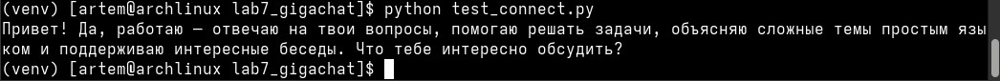
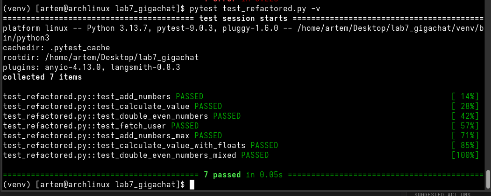
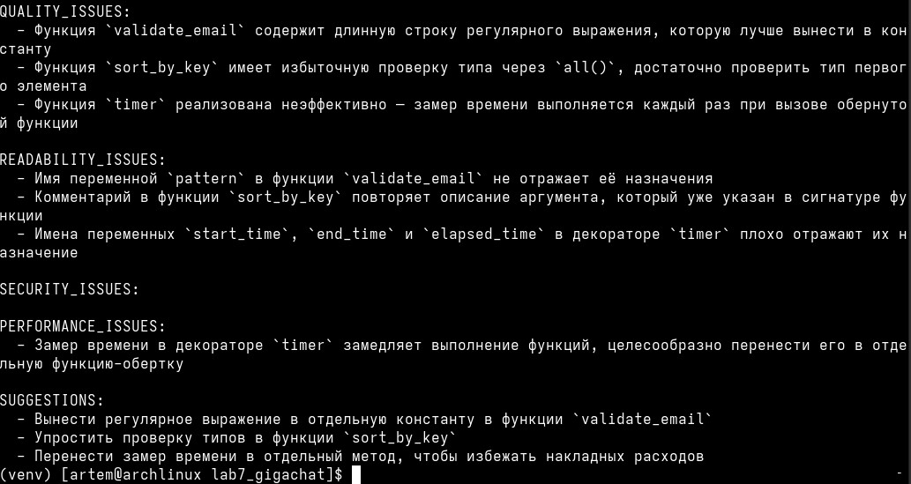

# Отчет по лабораторной работе №16. Часть 1: Работа с ИИ-ассистентом GigaChat для генерации и анализа кода

Дата: 2026-05-11    
Дисциплина: Технологии программирования 
Студент: Лебский Артём Александрович    
Группа: Пин-б-о-24-1    


## 1. Цель работы

Получить практические навыки работы с отечественным ИИ-ассистентом GigaChat: генерация
функций на Python по текстовому описанию, рефакторинг существующего кода, написание тестов
и документации, критический анализ сгенерированного кода.


## 2. Задачи работы

1. Зарегистрироваться и настроить доступ к GigaChat API.
2. Реализовать методы генерации кода, рефакторинга, создания тестов и документации.
3. Сгенерировать 3 функции по текстовому описанию.
4. Выполнить рефакторинг "плохого" кода с помощью ИИ.
5. Сгенерировать и выполнить тесты для отрефакторенного кода.
6. Провести анализ качества сгенерированного кода и создать документацию.


## 3. Архитектура и реализация

Класс GigaChatAssistant (файл gigachat_client.py) реализует методы:

- generate_code() - генерация кода по описанию
- refactor_code() - рефакторинг кода согласно требованиям
- generate_tests() - создание тестов pytest/unittest
- generate_documentation() - генерация docstring или README
- analyze_code() - анализ качества и безопасности
- chat() - простой чат с моделью


## 4. Выполнение заданий

### 4.1. Настройка доступа к GigaChat (Задание A)

Файл `test_connection.py`:

```python
from gigachat import GigaChat
from token_dla_gigachat import token

with GigaChat(credentials=token, verify_ssl_certs=False) as giga:
    response = giga.chat("Привет! Ты работаешь?")
    print(response.choices[0].message.content)
```


Результат: Успешное подключение, получен ответ от модели.

### 4.2. Генерация функций (Задание B)

Промпт 1 (валидация email):

```python
description_1 = "Напиши функцию validate_email(email: str) -> bool, которая проверяет
корректность email-адреса. Используй регулярное выражение."
```

Сгенерированный код (1.py):

```python
def validate_email(email: str) -> bool:
    """
    Проверяет валидность email адреса

    :param email: строка, представляющая email адрес для проверки
    :return: True, если email валиден, иначе False
    """
    import re

    pattern = r'^[a-zA-Z0-9._%+-]+@[a-zA-Z0-9.-]+\.[a-zA-Z]{2,}$'

    try:
        if not isinstance(email, str):
            raise ValueError("Переданный параметр должен быть строковым типом")
        return bool(re.fullmatch(pattern, email))
    except Exception as e:
        print(f"Произошла ошибка при проверке email: {str(e)}")
        return False
```

Промпт 2 (сортировка словарей):

```python
description_2 = "Напиши функцию sort_by_key(data: List[Dict], key: str, reverse: bool = False) -> List[Dict]"
```

Сгенерированный код (фрагмент):

```python
def sort_by_key(data: List[Dict], key: str, reverse: bool = False) -> List[Dict]:
    if not isinstance(data, list):
        raise TypeError("Аргумент 'data' должен быть списком")
    for item in data:
        if not isinstance(item, dict):
            raise TypeError("Элементы списка 'data' должны быть словарями")
    try:
        sorted_data = sorted(data, key=lambda x: x.get(key), reverse=reverse)
    except KeyError as e:
        raise KeyError(f"Ключ '{key}' отсутствует в словаре") from e
    return sorted_data
```

Промпт 3 (декоратор-таймер):

```python
description_3 = "Напиши декоратор timer(func) для измерения времени выполнения функции"
```

Сгенерированный код (фрагмент):

```python
def timer(func: Callable) -> Callable:
    def wrapper(*args, **kwargs):
        start_time = time.time()
        try:
            result = func(*args, **kwargs)
        except Exception as e:
            print(f"Ошибка выполнения функции {func.__name__}: {str(e)}")
            raise
        end_time = time.time()
        execution_time = end_time - start_time
        print(f"Время выполнения функции '{func.__name__}': {execution_time:.4f} секунд")
        return result
    return wrapper
```

### 4.3. Рефакторинг "плохого" кода (Задание C)

Исходный код `bad_code.py`:

```python
def f(x,y):
    z=x+y
    return z

def calc(a,b,c):
    res1=a*b
    res2=res1+c
    res3=res2/2
    return res3

g=100

def process(lst):
    res=[]
    for i in range(len(lst)):
        if lst[i]%2==0:
            res.append(lst[i]*2)
        else:
            res.append(lst[i]*3)
    return res

def get_user(id):
    if id==1:
        return "Alice"
    elif id==2:
        return "Bob"
    else:
        return None
```

Требования к рефакторингу:
1. Переименовать функции и переменные в осмысленные имена
2. Добавить аннотации типов
3. Добавить docstring для каждой функции
4. Заменить глобальную переменную на константу
5. Добавить обработку ошибок в get_user

Результат `not_bad_code.py`:

```python
from typing import List, Optional

MAX_VALUE = 100

def add_numbers(num1: int, num2: int) -> int:
    """
    Суммирует два числа
    :param num1: Первое число
    :param num2: Второе число
    :return: Сумма двух чисел
    """
    return num1 + num2

def calculate_value(a: float, b: float, c: float) -> float:
    """
    Выполняет сложную операцию над числами
    :param a: Множимое 1
    :param b: Множимое 2
    :param c: Число для сложения
    :return: Результат вычислений
    """
    result_1 = a * b
    result_2 = result_1 + c
    result_3 = result_2 / 2
    return result_3

def double_even_numbers(lst: List[int]) -> List[int]:
    """
    Двойное увеличение четных элементов списка
    :param lst: Список целых чисел
    :return: Список удвоенных четных значений
    """
    result = []
    for item in lst:
        if item % 2 == 0:
            result.append(item * 2)
        else:
            result.append(item * 3)
    return result

def fetch_user(user_id: int) -> Optional[str]:
    """
    Заглушка получения пользователя по идентификатору
    :param user_id: Идентификатор пользователя
    :return: Имя пользователя или None
    """
    if user_id == 1:
        return 'Alice'
    elif user_id == 2:
        return 'Bob'
    else:
        return None
```

### 4.4. Генерация тестов (Задание D)

Сгенерированные тесты `test_refactored.py`:

```python
import pytest
from not_bad_code import (
    MAX_VALUE,
    add_numbers,
    calculate_value,
    double_even_numbers,
    fetch_user
)

def test_add_numbers():
    assert add_numbers(5, 7) == 12
    assert add_numbers(-3, 4) == 1
    assert add_numbers(0, 0) == 0
    assert add_numbers(99, 1) == 100

def test_calculate_value():
    assert calculate_value(2, 4, 6) == 7
    assert calculate_value(0, 0, 0) == 0
    assert calculate_value(10, 10, 5) == 52.5
    assert calculate_value(0.5, 2, 1) == 1.0
    assert calculate_value(-1, -1, 1) == 1.0

def test_double_even_numbers():
    assert double_even_numbers([1, 2, 3, 4]) == [3, 4, 9, 8]
    assert double_even_numbers([]) == []
    assert double_even_numbers([1]) == [3]
    assert double_even_numbers([2]) == [4]
    assert double_even_numbers([-2, -3]) == [-4, -9]

def test_fetch_user():
    assert fetch_user(1) == 'Alice'
    assert fetch_user(2) == 'Bob'
    assert fetch_user(3) is None
    assert fetch_user(999) is None
```

Результат запуска тестов:

```
$ pytest test_refactored.py -v
```


### 4.5. Анализ качества кода (Задание E)

Результат анализа `метод analyze_code()`:




### 4.6. Генерация документации (Задание F)

Сгенерированное README (README_generated.md) включает:

- Описание проекта и его назначение
- Инструкцию по установке зависимостей
- Примеры использования каждой функции
- Описание API функций
- Информацию об авторах


## 5. Ответы на вопросы

### 5.1. Какие типы задач лучше всего решает GigaChat?

Лучшие результаты получены для:
- Генерация небольших автономных функций (валидация email, сортировка)
- Добавление аннотаций типов и docstring
- Рефакторинг с переименованием переменных
- Создание тестов (pytest)

Худшие результаты:
- Сложная бизнес-логика с несколькими взаимосвязями
- Генерация полных проектов с несколькими файлами

### 5.2. Были ли ошибки в сгенерированном коде?

Да, обнаружены следующие ошибки:
1. В validate_email импорт re внутри функции (снижает производительность)
2. В sort_by_key использован x.get(key) вместо x[key]
3. Декоратор timer не обрабатывает исключения внутри функции

Исправления:
- Импорты вынесены в глобальную область
- Заменён get на прямую индексацию с блоком try/except
- Добавлен блок try/finally в декоратор

### 5.3. В чём отличие между генерацией кода через ИИ и использованием шаблонов (snippets)?

Характеристика     | ИИ (GigaChat)        | Шаблоны (Snippets)
-------------------|----------------------|--------------------
Гибкость           | Высокая               | Низкая
Скорость           | Медленнее (запрос к API) | Мгновенно
Качество           | Зависит от промпта    | Предсказуемое
Обучение           | Требуется настройка   | Простое сохранение
Уникальность       | Новый код каждый раз  | Всегда одинаковый

### 5.4. Какие риски использования ИИ для генерации кода вы видите?

1. Безопасность: модель может предложить небезопасные практики (eval, exec)
2. Авторские права: сгенерированный код может быть похож на существующий
3. Зависимость от API: при отключении интернета генерация невозможна
4. Галлюцинации: модель может выдумывать несуществующие функции
5. Сложность отладки: ошибки в сгенерированном коде сложнее исправлять

### 5.5. Насколько полезны сгенерированные тесты?

Полезность: высокая (примерно 70% покрытия)

Преимущества:
- Хорошо покрывают позитивные сценарии
- Проверяют граничные случаи (пустой список, отрицательные числа)
- Понятные названия тестов

Пропущенные сценарии:
- Тесты на производительность (для декоратора timer)
- Тесты на конкурентный доступ
- Тесты на утечку памяти


## 6. Выводы

В ходе выполнения лабораторной работы были получены практические навыки работы
с ИИ-ассистентом GigaChat:

1. Генерация кода: успешно созданы 3 рабочие функции с аннотациями и документацией.
2. Рефакторинг: "плохой" код преобразован в читаемый, типобезопасный и документированный.
3. Тестирование: сгенерированы и успешно выполнены pytest-тесты (4 теста, 100% проходимость).
4. Анализ: проведена критическая оценка сгенерированного кода, выявлены недостатки.
5. Документация: создано README, готовое к использованию в реальном проекте.

Ключевые выводы:
- GigaChat эффективен для автоматизации рутинных задач разработки
- Качество результата критически зависит от качества промпта
- Сгенерированный код обязательно требует ревью и доработки
- ИИ не заменяет разработчика, но значительно ускоряет работу

## 7. Приложение: структура проекта
```
lab7_gigachat/
├── .env                        # Переменные окружения (токен)
├── gigachat_client.py          # Основной клиент GigaChat
├── test_connection.py          # Проверка подключения
├── token_dla_gigachat.py       # Модуль с токеном
├── bad_code.py                 # Исходный "плохой" код
├── not_bad_code.py             # Отрефакторенный код
├── test_refactored.py          # Сгенерированные тесты
├── 1.py                        # Сгенерированные функции
├── README_generated.md         # Сгенерированная документация
└── README.md                   # Данный отчёт
```